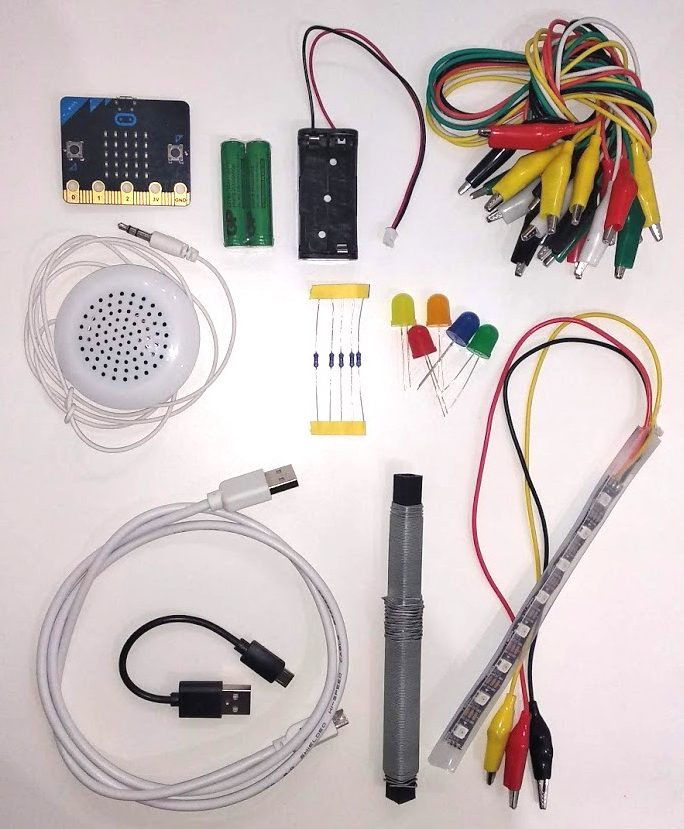

Title:   	Úvod
Teacher:	True

# Úvod
## 	O tutoriáli

Tento tutoriál sa skladá zo série aktivít, ktoré so svojím micro:bitom môžeš spraviť. Každá lekcia sa venuje inej téme
– v niektorých sa ocitneš v roli grafika a budeš tvoriť na displeji micro:bitu animácie, v iných zas prevezmeš rolu
bezpečnostného analytika a budeš navrhovať domáci alarm. Je to ideálne odpichnutie sa vo svete programovania hardvéru.

// LEFT

// RIGHT

Okrem **BBC micro:bitu** využívame najmä v neskorších kapitolách aj ďalšie pomôcky. Sú to hlavne:

* **batérie k micro:bitu** a **micro USB kábel**
* **individuálne adresovateľný LED pásik**
* **LED diódy s rezistormi**
* **klasický reproduktor**
* **krokosvorkové kábliky.**

Viac o používanej sade nájdeš na stránke [edutronik.sk](https://edutronik.sk/).

Ďalej pri aktivitách budeš potrebovať bežné vybavenie, ktoré nájdeš v domácich potrebách alebo v papiernictve, ako
napríklad:

* **kartón**
* **alobal**
* **nožnice, lepidlo, lepiaca páska**
* **papierové poháre/tanieriky/slamky**
* **vodivý drôt.**

Dôležitým aspektom nasledujúcich aktivít je programovanie, avšak možno ešte dôležitejším je prepájanie programovateľného
hardvéru s každodennými problémami a ich riešením. Podobné zariadenia ako micro:bit sa používajú v takmer každom
elektrickom zariadení – či už je to hriankovač, chladnička, práčka alebo vesmírny satelit.

Po prejdení tohto tutoriálu budeš mať veľmi dobrý prehľad o tom, ako využiť micro:bit v bežnom živote.

// END

!!! info "BBC micro:bit na vyučovaní "
    Pre každú aktivitu sme pripravili aj materiály pre učiteľa (metodiku, prípadne prezentáciu a pracovné listy).
    Na zobrazenie stačí na začiatku každej aktivity kliknúť na "Metodika pre učiteľa". Ak ale postupuješ podľa návodu
    doma bez učiteľa, tak môžeš túto sekciu úplne odignorovať.

!!! primary "Autor"
	Autorom tohto materiálu je **Marek Mansell**, ktorý spolu s kolegami zo združenia SPy pripravuje otvorene licencované materiály. Na recenzovaní sa podieľajú **PaedDr. Eva Klimeková, PhD.**, **Nika Klimová** a **Bibiána Kleinová**.

	Prosím, posielajte nám spätnú väzbu na [marek.mansell@pycon.sk](mailto:marek.mansell@pycon.sk).  
	Otázky sa nás môžete pýtať aj na micro:bit fóre – [forum.python.sk](https://forum.python.sk/).

	**Tento tutoriál je zverejnený pod licenciou CC BY-SA 4.0**  
	Táto licencia ti umožňuje používať, upravovať a zdieľať tento materiál akokoľvek uznáš za vhodné, pod podmienkou uvedenia autora a zachovania rovnakej licencie. [Celé znenie licencie](https://creativecommons.org/licenses/by-sa/4.0/).