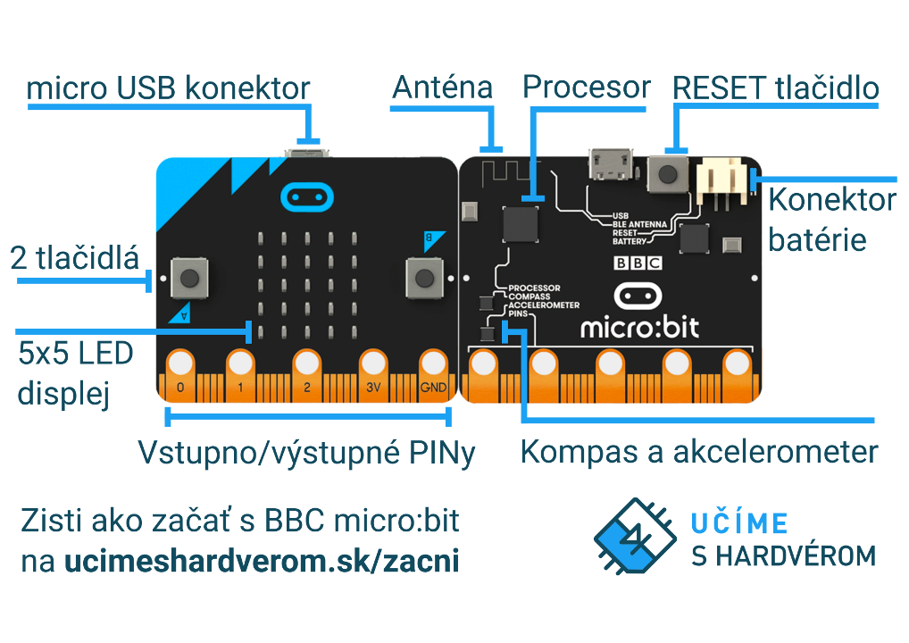

Title:   Zoznamovací program
Subtitle:    Skúmanie micro:bitu
Teacher:    True

# Zoznamovací program
## Skúmanie micro:bitu

// LEFT

// RIGHT

Táto lekcia slúži na zoznámenie sa s BBC micro:bit – čo to vlastne je, aké zabudované senzory obsahuje a čo s ním vieme spraviť.

**Potrebné pomôcky:**  
BBC micro:bit, USB kábel, batéria k micro:bitu, počítač pripojený k internetu

Na micro:bit budeme nahrávať [zoznamovací program](https://microbit.org/get-started/user-guide/out-of-box-experience/).

// END

### Úvod k mikroprocesorom

!!! primary ""
    Klasický procesor poznáš z počítačov – je "mozgom" každého počítača, keďže všetky výpočty sa dejú práve v ňom. K nemu
    je potom pripojená pamäť, displej, klávesnica atď.

    Mikroprocesor je veľmi podobný klasickému procesoru, až na jeden rozdiel – je oveľa menší. Tým pádom nie je ani taký
    výkonný, čo nám ale väčšinou nevadí. Využíva sa napríklad:

    * v práčke mikroprocesor ovláda čerpanie vody a motor práčky;
    * vo výťahu mikroprocesor "počúva", aké tlačidlá stlačíme, a podľa toho posiela výťah na jednotlivé poschodia,
      kde vždy otvorí a zatvorí dvere;
    * v inteligentných (smart) hodinkách mikroprocesor zobrazuje na displeji jednotlivé aplikácie;
    * v zabezpečovacom systéme mikroprocesor pomocou senzorov pohybu zisťuje, či je v dome nejaký pohyb, a následne spustí
      alarm a zašle SMS správu.
  
Mikroprocesory väčšinou interagujú s okolím. Táto interakcia by sa dala zjednodušene rozdeliť na **vstupy**
a **výstupy** z mikroprocesora.

// LEFT

**Príklad vstupov do mikroprocesora:**

* vypínače
* senzory svetla
* senzory pohybu
* teplomer
* senzory vlhkosti.

// RIGHT

**Príklad výstupov z mikroprocesora:**

* ovládanie svetiel
* ovládanie motorov
* spustenie alarmu
* ovládanie čerpadla
* vypisovanie na displeji.

// END

Takéto rôzne vstupy a výstupy budeme používať na tvorbu hardvérových projektov.

// NEWPAGE

### Zoznamovací program

Ak držíš v ruke úplne nový micro:bit, pravdepodobne má na sebe nahratý špeciálny zoznamovací program, vďaka ktorému si môžeš vyskúšať,
čo všetko micro:bit dokáže. Zistíš to tak, že po zapojení micro:bitu k počítaču pomocou klasického USB micro kábla
sa ti na obrazovke micro:bitu začne zobrazovať písmeno A spolu so šípkou vľavo.

Ak ale na micro:bite tento program nemáš, nezúfaj, veľmi jednoducho ho vieme stiahnuť.
Z [tohto odkazu](https://microbit.org/get-started/user-guide/out-of-box-experience/) si stiahni súbor, ktorý sa nazýva
*OutOfBoxExperience-v2.hex*. Potom pripoj svoj micro:bit k počítaču – ak si pozorne všimneš, počítač ti oznámi, že
sa k nemu pripojilo USB úložisko s názom **MICROBIT**. Teraz už len stačí stiahnutý program *OutOfBoxExperience-v2.hex*
prekopírovať do úložiska **MICROBIT**. Počas nahrávania by sa mala na chvíľu rozbliklikať malá žltá LED dióda na zadnej strane micro:bitu a po
jej doblikaní sa na micro:bit displeji zobrazí písmeno A spolu so šípkou vľavo.

Ak už máš program na micro:bite spustený, vyskúšaj si ho prejsť bez pomoci z tohto návodu (jednotlivé mini úlohy
sú celkom intuitívne). Ak by si potreboval(a) pomôcť, tu máš návod:

* Najprv treba na micro:bite stlačiť tlačidlo A (tlačidlo treba stlačiť poriadne).
* Následne treba stlačiť tlačidlo B.
* Poriadne zatrasenie micro:bitom (čím viac ním potrasieš, tým viac sa rozžiari LED displej).
* Spustí sa hra, v ktorej pomocou nakláňania micro:bitu "naháňaš" blikajúcu bodku.
* Keď úspešne prejdeš hrou, micro:bit ti bude zobrazovať animáciu srdiečka. Ak ale teraz stlačíš obe tlačidlá naraz,
  spustíš skrytú hru – hadíka.
  
Ak chceš spustiť hru od začiatku, stlač tlačidlo *RESET* na zadnej strane dosky.

### Skúmanie micro:bitu

Zopár senzorov, ako napríklad tlačidlá a senzor naklonenia/zatrasenia, sme si vďaka zoznamovaciemu programu vyskúšali, ale
aké ďalšie súčiastky micro:bit obsahuje? Čiastočne nám napovie aj samotný micro:bit – skús nájsť čo najviac
názvov senzorov, ktoré sú na doske vypísané.

// NEWPAGE

**Predná strana**  

* **2 tlačidlá** – micro:bit má 2 tlačidlá na prednej strane, ktoré môžeš naprogramovať tak, aby spúšťali nejakú časť kódu :-)
                 Tlačidlá sú označené tlačidlami  `A` a `B`.
* **5x5 LED displej** – 25 červených LED diód vieš využiť na zobrazovanie obrázkov, textu a čísel. Zároveň ale slúžia
                      ako senzor – môžeš nimi merať intenzitu svetla, ktoré dopadá na micro:bit.

**Zadná strana**  

* **Anténa** – micro:bit vie komunikovať 2 spôsobmi – buď s ďalšími micro:bitmi pomocou rádiovej komunikácie, alebo
               s inými zariadeniami pomocou Bluetooth. Klasické rádio si na ňom ale nenaladíš :-(
* **Procesor** – mozgom celého micro:bitu je mikroprocesor, ktorý vykonáva kód, ktorý naň nahráme. Obsahuje aj zabudovaný
                 teplomer, ktorý však nemeria teplotu prostredia, ale teplotu procesoru.
* **RESET tlačidlo** – toto tlačidlo reštartuje micro:bit a spustí nahratý program od začiatku.
* **Micro USB konektor** – slúži na nahrávanie programov do micro:bitu a aj na napájanie, aby sme nemuseli míňať
                           batérie.
* **Jedna žltá LED dióda** – indikuje, že micro:bit je pripojený k počítaču cez USB kábel a pri nahrávaní programu
                             bliká.
* **Konektor batérie** – namiesto USB kábla môžeme na napájanie micro:bitu použiť aj dve AAA batérie, ktoré pripojíme
                         k micro:bitu pomocou špeciálneho konektoru – tým pádom môžeš svoj micro:bit zobrať von z domu.
* **Kompas** – magnetický senzor meria silu magnetického poľa a okrem svetových strán ním dokážete určiť, či je v 
               blízkosti magnet.
* **Akcelerometer** - sníma naklonenie a pohyby micro:bitu.

!!! primary "Vstupno/výstupné piny (kolíky)"
    Na spodnej strane sú malé kovové plôšky, niektoré označené, iné nie. Slúžia na prepojenie micro:bitu s ďalšíme senzormi
    a aktormi – napríklad motorčekmi či senzormi vlhkosti pôdy. Pripojiť sa k nim dá takmer čokoľvek. Po anglicky sa nazývajú
    **pin**, čo sa do slovenčiny väčšinou prekladá ako **kolík**. Napriek tomu sa aj v slovenčine výraz "piny" často používa.

Niektoré z pinov (kolíkov) sú označené:

* `0`, `1` a `2` – tieto piný sú programovateľné a vieš vďaka nim čítať údaje z pripojených senzorov alebo
                 ovládať pripojené aktory.
* `GND` – skratka od GROUND, čiže po slovensky ZEM – externé senzory k nemu pripájame, aby sme ich uzemnili.
* `3V` – tento pin má privedené 3 volty a slúži na napájanie externých senzorov.

### Zhrnutie lekcie
V tejto lekcii sme sa zoznámili s micro:bitom pomocou zoznamovacieho programu a prešli sme si všetky jeho súčiastky. V ďalšej lekcii si vytvoríme v prostredí MakeCode prvý micro:bit program – digitálnu menovku, ktorá bude zobrazovať naše meno.