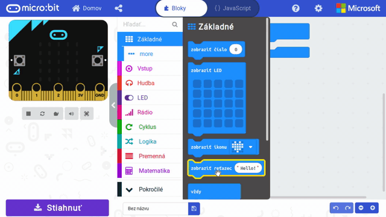
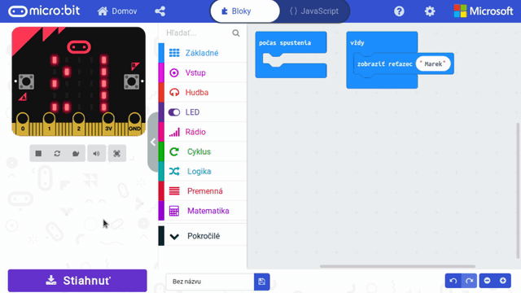

Title:   Digitálna menovka
Subtitle:    Programovanie displeja
Teacher:    True

# Digitálna menovka
## Programovanie displeja


// LEFT


// RIGHT

<div markdown="1" class="lection-desc">
V tejto lekcii sa naučíme tvoriť program v prostredí MakeCode a nahrávať ho na micro:bit – naším prvým programom
bude tvorba digitálnej menovky, ktorá bude zobrazovať naše meno. Následne do programu ešte pridáme obrázky.
</div>

**Potrebné pomôcky:**  
BBC micro:bit, USB kábel, batéria k micro:bitu, počítač pripojený k internetu

Pracovať budeme v online prostredí [makecode.microbit.org](https://makecode.microbit.org/)

// END


### Vypísanie textu na displeji

Náš prvý program vyskúšame spraviť v online prostredí [makecode.microbit.org](https://makecode.microbit.org/).
V ňom si vytvoríme digitálnu "menovku", ktorá bude zobrazovať naše meno a aj nejaké obrázky. Bude nám k tomu stačiť iba
BBC micro:bit a micro USB kábel.


!!! success ""
    **Micro:bit pripoj obyčajným micro USB káblom k počítaču (rovnaký kábel sa používa aj na napájanie telefónov).**

// LEFT



// RIGHT

Postup programovania v MakeCode:

* vytvorenie nového projektu
* naprogramovanie programu
* overenie správnosti v simulátore (v ľavej časti prostredia MakeCode)
* stiahnutie programu na BBC micro:bit.

V prostredí [MakeCode](https://makecode.microbit.org/) klikni na *Nový projekt*. V prípade, že sa prostredie otvorí
v anglickom jazyku, prepnúť ho vieš kliknutím na ozubené koliesko hore vpravo a v sekcii *Language* vyber
*Slovenčinu*.

// END


// LEFT


V našom prostredí máme 3 časti:

* vpravo je miesto na tvorbu nášho programu;
* v strede je knižnica príkazov, ktoré môžeme použiť;
* na ľavej strane je simulátor.

Keďže chceme vytvoriť menovku, musíme na displej vypísať naše meno. To spravíš príkazom `zobraziť reťazec` z kategórie
`Základné`, ktorý vložíš do príkazu *vždy*. Následne doň vpíš svoje krstné meno, ktoré by sa malo na simulátore začať zobrazovať.

// RIGHT



// END

// NEWPAGE

!!! success "Reťazec"
    Textový reťazec (anglicky "string") je postupnosť znakov (písmen, medzier, čísiel atď.) V programovaní
    ho používame, keď chceme pracovať s textom (v tejto aktivite je tým textom naše meno).


Simulátor je veľmi praktická pomôcka, ktorá ušetrí množstvo času – vždy si v ňom svoj program skontroluj ešte pred
nahraním na samotný micro:bit.

Keď sme s naším programom spokojní, môžeme kliknúť na tlačidlo *Stiahnuť*, ktoré stiahne program s príponou *.hex* na
počítač.

// LEFT


Posledný krok, ktorý nám zostáva, je nahrať novo vytvorený program na samotný micro:bit. Ten si pripoj
k počítaču pomocou klasického micro USB kábla, aký sa bežne používa na mobilné telefóny. V počítači potom uvidíš,
že micro:bit sa pripojil ako USB zariadenie, ako keby to bolo klasické USB úložisko. Naň stačí už len stiahnutý
program s príponou *.hex* skopírovať. **Stiahnutý súbor neotváraj ani nespúšťaj na počítači**.
Indikačná LEDka na micro:bite by sa mala na chvíľu rozblikať a po chvíľke
začne micro:bit vypisovať tvoje meno. Ak sa ale pozrieš naspäť do USB úložiska *MICROBIT*, súbor s príponou *.hex* tam neuvidíš, aj keď sa na micro:bit už nahral.

// RIGHT

```makecode
_X85Cks9pj4Ra
```

// END


!!! danger "Prečo mi nefunguje menovka nefunguje?"

    *   V prvom rade je potrebné skontrolovať USB kábel, prípadne vypojiť a znovu zapojiť USB kábel a znovu vyskúšať nahrávanie.
    *   Má užívateľ na počítači právo pristupovať k USB portom? Toto býva problémom najmä na firemných počítačoch – vtedy treba
        kontaktovať firemného administrátora.
    *   Vygenerovaný .hex súbor sa zväčša (podľa nastavenia webového prehliadača) stiahne do adresára “Downloads”
        (“Prevzaté súbory”). V prípade, že je tento adresár zaplnený inými nepotrebnými súbormi, odporúčame nepotrebné
         súbory vymazať, aby si nemusel/a pracne hľadať stiahnuté programy.
   
       
### Zobrazovanie obrázkov

Do nášho programu chceme pridať obrázok pomocou príkazu `zobraziť LED` z kategórie `Základné`. Tento príkaz umožňuje
vyklikať si akýkoľvek obrázok. Skús vyklikať na micro:bite obrázok srdiečka. Tento príkaz vložíme za príkaz `zobraziť
reťazec`.

Či sa nám obrázok zobrazuje správne, si overíme v simulátore. Až následne sťahujeme program do micro:bitu.

// LEFT


// RIGHT

```makecode
_f7jFu1UruaHK
```

// END

Druhým spôsobom, ako môžeme pridávať obrázky na micro:bit, je príkaz `zobraziť ikonu` (kategória `Základné`). Tento príkaz už má preddefinované
 základné obrázky na displeji.

// LEFT

// NEWPAGE

!!! info "Doplňujúce úlohy"
    * Pridaj do programu ďalšie obrázky, prípadne striedaj vypisovanie textu a obrázkov.
    * V programe použi aj vlastné, aj predprogramované obrázky.

// RIGHT

```makecode
_JwgbcRT8P0aD
```

// END

### Pauzy medzi príkazmi

// LEFT

Naša digitálna menovka momentálne zobrazuje meno a nejaký obrázok. Čo by sme mali spraviť, ak by sme chceli, aby obrázok zostal na micro:bite
zobrazený dlhšie – napríklad 15 sekúnd? To sa dá spraviť celkom jednoducho pomocou príkazu `pozastaviť (ms)`
(z kategórie `Základné`). Tento príkaz pozastaví vykonávanie programu na nastavený počet milisekúnd.

!!! success "Milisekundy"
    Milisekunda (skratka ms) je jednotkou času – jedna milisekunda je tisícinou sekundy, čiže jedna sekunda má tisíc
    milisekúnd. Niekoľko príkladov:

    * 500 ms = pol sekundy
    * 2000 ms = dve sekundy
    * 10 000 ms = desať sekúnd 

// RIGHT

```makecode
_gHx19V3wU6RT
```   
    
// END

!!! primary "Záverečné otázky"
    * Je jedno, či umiestniš príkaz pozastaviť pred alebo po príkaze `zobraziť LED`? (Vyskúšaj.)
    * Čo robí micro:bit počas vykonávania príkazu `pozastaviť (ms)`? (Nič, iba čaká.)
    
### Zhrnutie lekcie
V tejto lekcii sme si naprogramovali našu "digitálnu menovku". Ak ju chceš teraz použiť, môžeš micro:bit odpojiť od USB kábla a pripojiť k micro:bitu batériu. Aj po pripojení k batérii tvoj program zostane uložený na micro:bite a začne sa automaticky vykonávať.