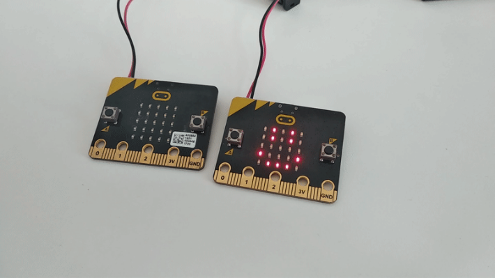
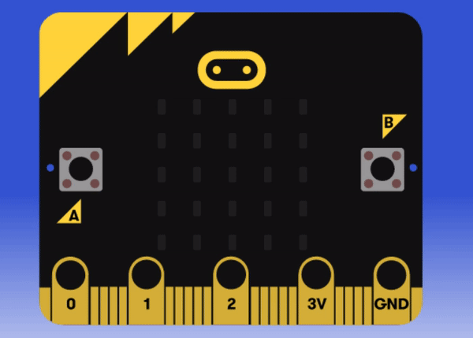

Title:   Tlačidlá
Subtitle:    a programovanie animácií
Teacher:	True

# Tlačidlá na micro:bite
## a programovanie animácií

// LEFT



// RIGHT

<div markdown="1" class="lection-desc">
V tejto lekcii sa zoznámiš s tlačidlami na BBC micro:bite – ako ich využiť pri tvorení vlastného programu a ako
zistiť, či boli stlačené. Prepojíme ich potom s animáciami na displeji.
</div>

**Potrebné pomôcky:**  
BBC micro:bit, USB kábel, batéria k micro:bitu, počítač pripojený k internetu

Pracovať budeme v online prostredí [makecode.microbit.org](https://makecode.microbit.org/)

// END

!!! primary "Tlačidlá všade okolo nás"
	Tlačidlá sú jedným z najrozšírenejších elektronických komponentov vôbec – nachádzajú sa na ovládačoch, práčkach,
	hracích konzolách, platobných termináloch... Používame ich na ovládanie elektroniky – vždy, keď chceme, aby nejaký
	mikroprocesor niečo vykonal (napríklad poslal na naše poschodie výťah), oznámime mu to pomocou tlačidla.

	**Micro:bit má 2 tlačidlá, ktoré vieme využiť v našom programe (sú označené ako tlačidlá A a B).**

#### Stlačenie jedného tlačidla

// LEFT

Snímanie stlačenia tlačidla je na micro:bite veľmi jednoduché – stačí použiť príkaz `keď sa tlačidlo A stlačí`
z kategórie `Vstup`. Skús naprogramovať jednoduchý program, ktorý pri stlačení tlačidla A zobrazí šťastného smajlíka
a pri stlačení tlačidla B smutného smajlíka. Program si najprv vyskúšaj v simulátore a až potom ho nahraj na micro:bit.

// RIGHT

```makecode
_WotWzfe3edtk
```

// END

#### Stlačenie dvoch tlačidiel

// LEFT

Skúsme teraz náš jednoduchý program doplniť aj o tretieho smajlíka – tentokrát zmäteného. Toho zobrazíme pri stlačení
oboch tlačidiel naraz. Ako si ale program odskúšaš v simulátore? Ak si pozorne všimneš, po pridaní príkazu
`keď sa tlačidlo A + B stlačí`  sa ti v simulátore na pravej spodnej strane micro:bitu zobrazí nové biele tlačidlo A+B.
To samozrejme na skutočnom micro:bite nenájdeš, nachádza sa iba v simulátore, aby bolo možné odskúšať stlačenie oboch
tlačidiel naraz.

// RIGHT

```makecode
_YYbcCri139yV
```

// END

// NEWPAGE

### Animácia – smajlík prichádza a odchádza

// LEFT

Doteraz sme jednoducho zobrazovali obrázky bez nejakej animácie. To teraz ale zmeníme – vytvoríme animáciu smajlíka,
ktorý k nám postupne prichádza a potom naopak odchádza.



Chceme docieliť, aby sa nám pri stlačení tlačidla A z pravej strany postupne posúval smajlík, až kým ho neuvidíme celého.
Keď následne stlačíme tlačidlo B, smajlík sa bude posúvať ďalej do ľavej strany a postupne odíde. Využijeme na to príkaz
`zobraziť LED` a pre každú jednu snímku animácie použijeme osobitný príkaz `zobraziť LED`.

// RIGHT

```makecode
_6g4iuUideezy
```

// END

// NEWPAGE

### Animácia naprieč micro:bitmi

// LEFT

Na túto aktivitu budeš potrebovať 2 micro:bity. Ak máš iba jeden, spoj sa s kamarátom alebo kamarátkou, ktorý(á) má tiež micro:bit
a skúste si naprogramovať animáciu spoločne.

Smajlíka máme pekne animovaného, na displej nám prichádza aj odchádza, ďalším krokom je animovať ho naprieč viacerými
micro:bitmi. Postupne sa bude zobrazovať na jednom micro:bite a potom prejde na druhý. Vytvoríme teda dve
animácie, na jednom micro:bite sa začne ihneď po stlačení oboch tlačidiel naraz a na druhom micro:bite až po niekoľkých
sekundách. Ako ale určiť po koľkých sekundách sa má smajlík zobraziť na druhom micro:bite? Najjednoduchšie je odmerať čas stopkami a potom na začiatku
animácie pre druhý micro:bit použiť príkaz `pozastaviť (ms)`.

 

Do jedného micro:bitu nahraj animáciu bez pauzy a do druhého s pauzou pred animáciou.

// RIGHT

```makecode-no-link
_H8ViD53xecrd
```

```makecode-link-only
_bECDj52XxUzo
```

// END

### Bliknutie srdiečkom

// LEFT

Poslednou úlohou je vytvoriť "bliknutie" srdiečkom – po stlačení tlačidla sa na 5 sekúnd zobrazí srdiečko a následne zmizne.

To, ako zobraziť obrázok na 5 sekúnd, už vieme, ale ako vymazať obrazovku? Môžeme to spraviť dvoma spôsobmi – buď
príkazom `zobraziť LED`, ktorý necháme prázdny, alebo príkazom `Vymazať obrazovku` z kategórie `Základné`.

// RIGHT

```makecode
_0vjfTmdeMfCf
```

// END

### Zhrnutie lekcie
V tejto lekcii sme sa naučili používať tlačidlá micro:bitu v našich programoch. Budeme ich používať často,
keďže tlačidlá sú jedným z najčastejšie používaných elektronických komponenetov. Nie je to však jediný spôsob, akým vieme
micro:bitu povedať, aby niečo spravil – už v ďalšej lekcii sa pozrieme, ako ovládať micro:bit pomocou pohybu.

