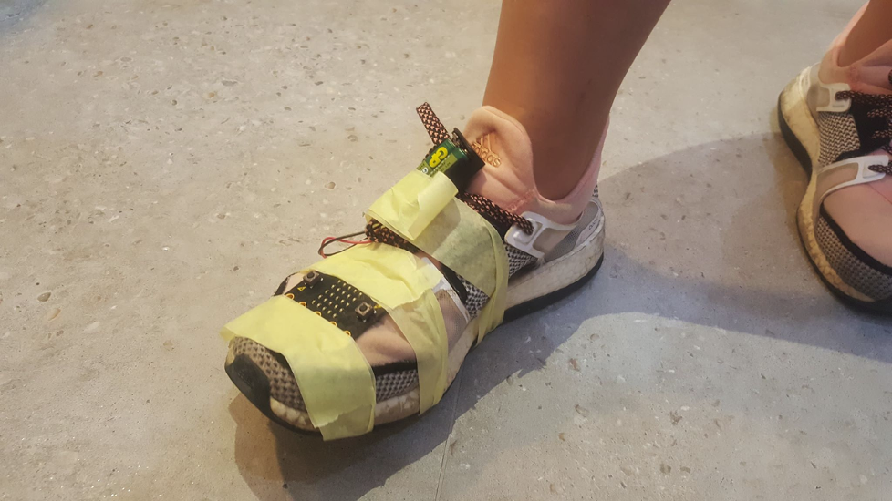
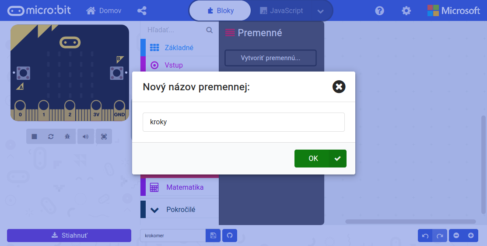

Title:   Krokomer
Subtitle:    Koľko krokov denne spravíš?
Teacher:	True

# Krokomer
## Koľko krokov denne spravíš?

// LEFT



// RIGHT

<div markdown="1" class="lection-desc">
Krokomer (anglicky pedometer) je zariadenie na meranie počtu krokov. Dnes sa často nachádza vbudovaný aj v mobilných
telefónoch, ktoré ukazujú, koľko krokov človek za deň spravil. Krokomer sa dá na micro:bite spraviť pomocou vbudovaného
senzoru pohybu.
</div>


**Potrebné pomôcky:**
BBC micro:bit, USB kábel, batéria k micro:bitu, počítač pripojený k internetu,
papierová lepiaca páska (ľahšie sa dá dať dolu z oblečenia ako klasická páska), nožnice, topánky

Pracovať budeme v online prostredí [makecode.microbit.org](https://makecode.microbit.org/)

// END

!!! primary "Krokomer"

	Krokomer (anglicky pedometer) je zariadenie na meranie počtu krokov. Dnes sa často nachádza vbudovaný aj v mobilných
	telefónoch, ktoré ukazujú, koľko krokov človek za deň spravil. Krokomer sa dá na micro:bite spraviť pomocou vbudovaného
	senzoru pohybu. Ak pripevníme micro:bit na nohu, stačí merať, koľkokrát zariadením zatrasieme, a tým získame počet
	krokov. Na takomto princípe funguje aj väčšina moderných krokomerov. Upozorňujeme však, že takéto meranie nemusí byť
	úplne presné – malé kroky sa merajú len veľmi ťažko, naopak veľmi aktívny pohyb nohou môže spôsobiť, že krokomer ukáže
	viac krokov, ako v skutočnosti človek spravil. 


### Program pre krokomer


Ako na micro:bite vytvoriť krokomer? Najprv si navrhneme požiadavky (aký má byť výsledok), potom vytvoríme program
a následne micro:bit pripevníme na topánku a otestujeme. 

// LEFT



Požiadavky na micro:bit krokomer:  

* Pri potrasení micro:bit zväčší premennú `kroky` o 1.
* Zobraziť počet krokov na displeji, keď sa tlačidlo A stlačí.
* Vynulovať kroky pri stlačení tlačidiel A a B naraz.

// RIGHT


```makecode
_JDkLUCh2i5gH
```

// END

Na počítanie krokov použijeme premennú s názvom `kroky`, ktorú pri každom potrasení (kroku) zvýšime o 1. Krok meriame
potrasením micro:bitu, keďže bude fyzicky pripevnený na topánke.

Počet krokov nebude krokomer zobrazovať vždy, ale iba pri stlačení tlačidla `A`. Najprv sa zobrazí počet krokov
(príkazom `zobraziť číslo`, do ktorého vložíme premennú `kroky`). Číslo po jednej sekunde vymažeme z obrazovky,
aby sa nestalo, že nám bude celý čas svietiť neaktuálne číslo krokov.

Niekedy možno budeme chcieť premazať počet krokov a začať počítať znovu od 0. To spravíme vždy pri stlačení oboch
tlačidiel – aj `A`, aj `B`.

!!! primary "Overenie v simulátore"
	Pri vývoji hardvéru sa bežne na overenie funkčnosti využívajú simulátory. Takéto testovanie je oveľa rýchlejšie
	a lacnejšie, ako vždy program nahrať do hardvéru a testovať ho tam.

!!! primary "Koľko krokov mám denne spraviť?"
	Koľko krokov je vhodných pre človeka denne? Presná odpoveď
	neexistuje, no štúdie dokazujú, že približne 7000 krokov je dostatočne veľa
	[(článok)](https://www.noviny.sk/zaujimavosti/367839-malo-sa-hybeme-tvrdia-odbornici-kolko-krokov-by-sme-teda-mali-spravit).
	Vedci taktiež tvrdia, že ak človek pravidelne prejde _"menej ako 5000 krokov denne, zvyšuje sa u neho riziko priberania,
	rednutia kostí a ďalších problémov... Vedci sa zaujímajú aj o hornú hranicu. Avšak podľa doteraz zistených štúdií je
	čím viac, tým lepšie a najmä podľa toho, koľko človek vládze."_

### Hardvér pre krokomer
Ak máme program odskúšaný v simulátore aj fyzicky na micro:bite, môžeme ho odpojiť od počítača a pripojiť k batérii.
Takýto krokomer je potrebné umiestniť na topánku – odporúčame pripevniť micro:bit na prednú stranu topánky navrch
(viď nižšie na foto). Pri takomto umiestnení má najlepšiu presnosť. Dá sa samozrejme pripevniť aj zboku topánky,
ale z našich skúseností bývajú merania na tomto mieste nepresnejšie. Krokomer sme prilepili papierovou lepiacou páskou,
ktorá ide dolu z topánky ľahšie ako klasická páska a nemala by zanechávať žiadne stopy.

// LEFT


Pomôcky pre tvorbu krokomeru

// RIGHT


Výsledok – krokomer pripevnený papierovou lepiacou páskou

// END

!!! primary "Záverečné otázky"
    *   Na čo slúži krokomer?
    *   Aký senzor používa na snímanie krokov?
    *   Koľko krokov by mal človek denne spraviť?
    *   Čo hrozí človeku, ktorý sa dostatočne nehýbe?

