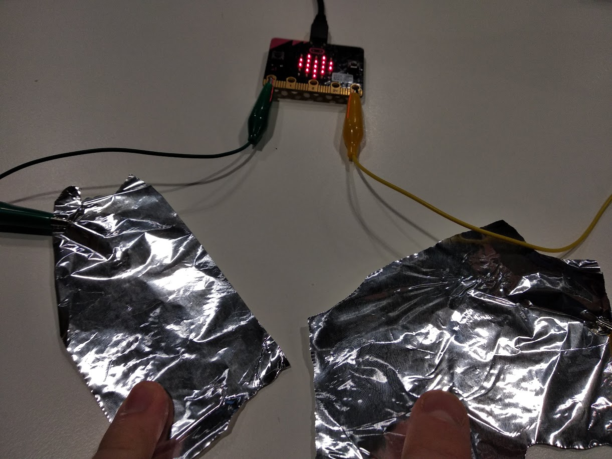

Title:   Krokosvorkové káble

# Krokosvorkové káble
## Druhá kapitola

// LEFT

V druhej kapitole budeme okrem samotného micro:bitu využívať aj ďalšie komponenety, ako napríklad reproduktor, alobal či drôt. S kolíkmi na micro:bite ich budeme prepájať pomocou krokosvorkových káblikov.

// RIGHT

### Zoznam lekcií

* 2.1. Hudba
* 2.2. Vodivosť materiálov
* 2.3. Hra horúci drôt
* 2.4. Sedačková mína
* 2.5. Gitara
* 2.6. Tikajúca bomba 

// END