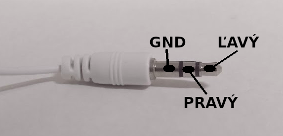

Title:   Hudba
Subtitle:    Zahraj Kohútika jarabého
Teacher:	True

# Programovanie hudby
## Zahraj Kohútika jarabého

// LEFT


// RIGHT

<div markdown="1" class="lection-desc">
K micro:bitu je možné pripojiť akýkoľvek reproduktor s klasickým "Jack" vstupom a prehrávať na ňom hudbu.
</div>


**Potrebné pomôcky:**  
BBC micro:bit, USB kábel, batéria k micro:bitu, počítač pripojený k internetu, krokosvorkové káble, reproduktor

Pracovať budeme v online prostredí [makecode.microbit.org](https://makecode.microbit.org/)

// END

### Propojenie reproduktora

Ako je možné, že reproduktor vie, akú hudbu má prehrávať? Väčšina reproduktorov
(vrátane slúchadiel) ako vstup používa špeciálny konektor, ktorý sa nazýva tri-a-pol milimetrový JACK (3,5 mm JACK).
Jeho fotku nájdeš nižšie.
Tri a pol milimetra kvôli tomu, že presne taký priemer konektor má (pokojne si to môžeš skontrolovať pravítkom).

Na to, aby sme z micro:bitu dokázali prehrávať hudbu, nám stačí vziať akýkoľvek reproduktor, ktorý má ako vstup
3,5 mm JACK a prepojiť ho pomocou elektrických káblov s micro:bitom.

!!! primary "Ako 3,5 mm JACK vyzerá?"
    
	Konektor má zväčša 2 plastové prúžky, ktoré oddeľujú 3 kovové časti (kontakty) konektora.
	Väčšinou sa takýto konektor používa na ovládanie 2 reproduktorov (pravého a ľavého) a každý má svoj vlastný vstupný
	signál (a teda aj vlastný kontakt na 3,5 mm JACK). Tretí kovový kontakt (najbližšie k plastovej časti) je spoločné
	uzemnenie oboch reproduktorov (anglicky *"ground"*, skratka *GND*).

	Niektoré slúchadlá majú namiesto 3 kovových kontaktov až 4 – to vtedy, ak majú slúchadlá v sebe zabudovaný aj mikrofón,
	ktorý používaš pri telefonovaní.


// LEFT

Keď už vieme, na čo jednotlivé časti konektora slúžia, pripojíme ich k micro:bitu pomocou krokosvorkových káblov.
Krokosvorkové káble sú obyčajné elektrické kábliky, ktoré majú na konci "krokodílku" – kovový konektor. Síce majú
rôzne farby, ale tie slúžia iba na to, aby sme ľahšie vedeli rozlíšiť, ktorý káblik ide kam. Inak fungujú všetky rovnako.

Na micro:bite budeme kábliky pripájať ku kolíkom. Kolíky sú malé kovové plôšky na spodnej strane micro:bitu
(anglický názov je “pin”). Na micro:bite sa nachádza 5 väčších kolíkov s označením *0*, *1*, *2*, *3V* a *GND*.

Nakoľko budeme používať iba jeden reproduktor, postačí nám iba jeden vstup na 3,5 mm JACKu (pre ľavý reproduktor)
a uzemnenie (GND). Reproduktor k micro:bitu pripojíme takto:

*   kontakt pre ľavý reproduktor na 3,5 mm JACKu  -> kolík 0 na micro:bite
*   kontakt GND na 3,5 mm JACKu -> kolík GND na micro:bite

 
// RIGHT




// END


// NEWPAGE

### Prehranie predprogramovanej melódie


// LEFT

Na programovanie reproduktora budeme využívať príkazy z kategórie `Hudba`. Ako prvé si vyskúšame prehrať už
predprogramovanú melódiu pri stlačení tlačidla A. Použijeme na to príkaz `spustiť melódiu dadadum opakovanie raz`.

Či program funguje, si vieš odskúšať aj v simulátore (bude ale prehrávať hudbu na reproduktoroch počítača a nie na tom, ktorý
máš pripojený k micro:bitu).

Ak ti program zafungoval v simulátore, nahraj ho na micro:bit a odskúšaj.

// RIGHT

```makecode
_8cr70Vgcp1pX
```

// END

!!! danger "Reproduktor mi nefunguje..."
    **Možné chyby:**
    
    *   Nesprávne zapojenie reproduktora, ako napríklad zámena koncov krokosvoriek (skontroluj si zapojenie).
    *   Krokosvorka je pripojená na viac ako jednu kovovú časť JACK konektora (skontroluj, či sa náhodou jedna
        korkosvorka nedotýka až dvoch kovových konektorov na JACKu).
    *   Hudbu nikdy neprehrávame v bloku *vždy*, ale iba pri stlačení tlačidiel.


### Kohútik jarabý
// LEFT

Micro:bit má niekoľko predprogramovaných melódií, čo však v prípade, ak chceme prehrať nejakú pieseň? Aj to sa dá na micro:bite
naprogramovať, a to tvorbou melódie skladaním jednotlivých tónov piesne.

Vyskúšaj si najprv pri stlačení tlačidla A prehrať tón “stredné C” – ten na klavíri nájdeš približne v strede.

// RIGHT

```makecode
_hWVPaAXzih6X
```

// END

Z tónov je možné tvoriť aj náročnejšie melódie, napríklad pieseň Kohútik jarabý.
Na to použijeme hudobné noty, no najprv budeme potrebovať vedieť, ako čítať notový zápis.

Pozri sa na nasledujúce noty:


Veľa čiar a nôt, ale čo znamenajú?

Keď sa pozrieš na príkaz, akým sme prehrávali jeden tón, nastavujeme v ňom dve informácie – aký tón chceme prehrať
a ako dlho má trvať (koľko úderov). Oboje sa dá z hudobných nôt ľahko zistiť.

// NEWPAGE

!!! primary "Ako zistiť tón noty" 
	Umiestnenie noty “na čiare” určuje tón noty (napríklad C, D atď.) – aby sme to ale nemuseli pracne počítať, nad každou
	notou je napísaný jej tón. Skús sa napríklad pozrieť, kde sa nachádza tretia nota (má nad sebou napísané *E*). Každá
	ďalšia nota *E* v piesni je vždy na tej istej čiare.

!!! primary "Ako zistiť trvanie noty"
	
	// LEFT
	
	To, ako nota vyzerá, určuje trvanie noty (udáva sa v úderoch) – pomôž si "ťahákom" nižšie. V piesni Kohútik jarabý
	sa nachádzajú iba 2 druhy nôt – štvrťové (s trvaním jedného úderu) a osminové (s trvaním pol úderu). Štvrťové a osminové
	noty veľmi ľahko rozlíšiš – kým štvrťová sa skladá iba z jednej guličky a jednej paličky, osminové sú spojené ďalšou
	čiarkou.

	// RIGHT

	

	// END


// LEFT

Nasledujúci program prehrá prvých šesť nôt piesne Kohútik jarabý:

```makecode
_WA99o6bu4AyJ
```

Skús teraz tón po tóne naprogramovať celú pieseň Kohútik jarabý. Keď si budeš chcieť svoj program skontrolovať alebo
nebudeš vedieť, ako pokračovať, tu nájdeš celú pesničku:
[https://makecode.microbit.org/_YA7KHghHed0z](https://makecode.microbit.org/_YA7KHghHed0z)

// RIGHT

### Nastavenie tempa

Rôzne piesne majú rôzne rýchle tempo. To vieš nastaviť aj na micro:bite príkazom `nastaviť tempo na (bpm) ...`
(príkaz z kategórie “Hudba”). *BPM* je skratka pre *beats per minute* (anglicky počet „úderov“).

Ak nenastavíme tempo my, micro:bit túto hodnotu nastaví za nás na 120. Skúsme ho ale zmeniť napríklad na 240. Bude sa
pieseň Kohútik jarabý prehrávať inak?

Príkaz na zmenu tempa vlož ešte pred prehrávanie hudby, tak ako je na obrázku nižšie: 

```makecode
_T7TCfECsLWi4
``` 

// END