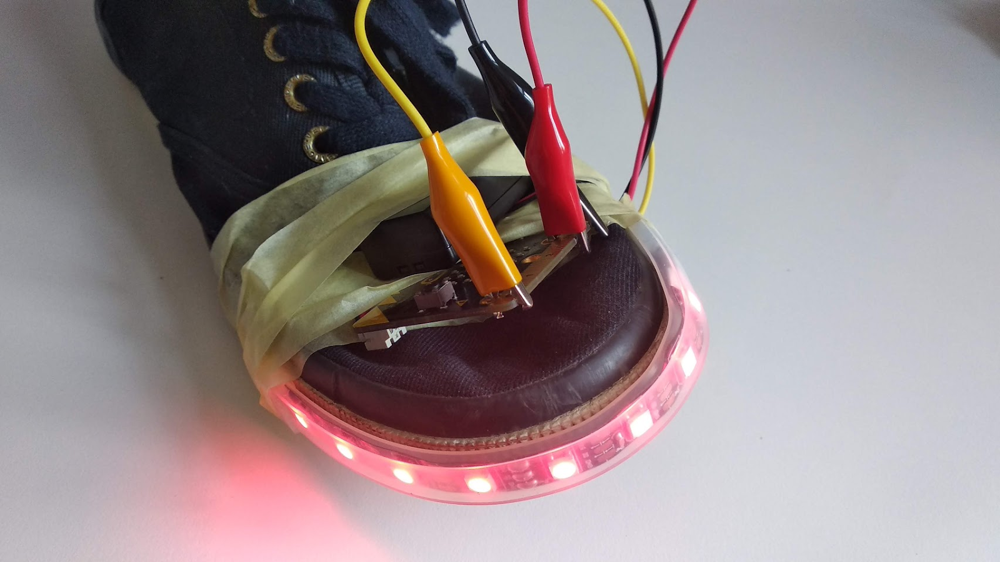

Title:   LED

# LED
## Tretia kapitola

// LEFT

V tretej kapitole budeme pomocou micro:bitu rozsvecovať LEDky - od klasických jednofarebných LED diód, až po LED pásiky. Na tých si budeme zobrazovať aj rôzne animácie.

// RIGHT

### Zoznam lekcií

* 3.1. LED diódy
* 3.2. Semafor
* 3.3. LED pásik
* 3.4. Wearables 

// END