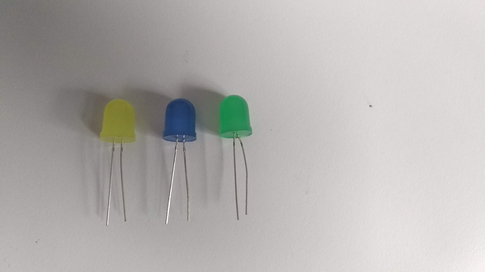
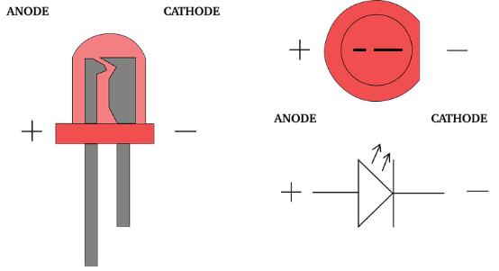

Title:   LED diódy
Teacher:  True

# LED diódy
## Ako programovať LEDky?

// LEFT


// RIGHT

*V tejto lekcii sa naučíme, ako zapojiť LED diódu, na čo slúži rezistor a ako elektronicky spínať LED diódu v prostredí MakeCode.*


**Potrebné pomôcky:**
BBC micro:bit, USB kábel, batérie pre BBC micro:bit, krokosvorkové káble, počítač pripojený na internet, LED diódy, adekvátne rezistory, vodivé materiály (napr. kľúč, minca, alobal)

Pracovať budeme v online prostredí [makecode.microbit.org](https://makecode.microbit.org/)

// END

!!! primary "Klasické žiarovky, žiarivky, ledky, ..."
    * **Klasické žiarovky** vynašli už v 18. storočí a svietia pomocou rozžeravenia vlákna vo vnútri žiarovky (v tej je obvykle vákuum alebo nejaký špeciálny plyn). Žiarovky majú väčšinou priehǎldné sklo, čiže by si mal(a) vidieť drôt vo vnútri. Okrem toho, že takéto žiarovky vedia byť veľmi horúce, spotrebujú veľké množstvo elektriky.
    * **Žiarivky** sú oveľa úspornejšie ako žiarovky (až o 80%), a to vďaka tomu, že svetlo vzniká elektrickými výbojmi, ktoré dopadajú na bielu farbu, ktorou je žiarivka väčšinou pokrytá.
    * **LEDky** sú najnovším a zároveň aj najefektívnejším spôsobom svietenia - spotrebujú menej energie a vydržia dlhšie, ako žiarovky či žiarivky.

### Ako vyzerá LED dióda?

// LEFT


*3 rôzne LED diódy // ToDo: spraviť foto aj s rezistormi*

LEDka je súčiastka, ktorá sa vyrába v rozdielnych veľkostiach, tvaroch a farbách. My budeme pracovať s okrúhlymi LEDkami, ktoré majú dve *nožičky* - elektrické kontakty. Tie majú rozdielnu dĺžku:

* Kratšiu nožičku nazývame *katóda*. Ak by sme chceli LEDku pripojiť k baterke, pripojili by sme ju k *mínusovej* strane. Na micro:bite ju budeme pripájať ku kolíku **GND**. Nad katódou je okrúhle plastové púzdro trošku "zrezané".
* Dlhšiu nožičku nazývame *anóda*. K baterke by sme ju pripojili k *plusovej* strane, na micro:bite ju budeme pripájať ku kolíku **3V**

// RIGHT



*Označenie anódy a katódy, vpravo dolu schématická značka*

LEDky fungujú v zásade na veľmi jednoduchom princípe - ak na *anódu* pripojíme správne plusové napätie (na micro:bite kolík **3V**) a na *katódu* uzemnenie (na micro:bite kolík **GND**), mala by sa rozsvietiť. Na rozdiel od klasických žiaroviek LEDkám nevadí, ak ich veľa krát zapíname a vypíname.


// END

// NEWPAGE

!!! primary "Rezistor"
    Ak by sme zapojili LED diódu k micro:bitu na priamo (anódu na **3V** a katódu na **GND**) tak by sa po chvíli pravdepodobne vypálila. Je to spôsobené tým, že samotnou LEDkou by pretekal príliš veľký prúd, ktorý by ju spáli. Aby sme tomu predišli, použijeme *rezistor* - elektronickú súčiastku, ktorá limituje množstvo prúdu pretekajúceho obvodom a tým ochráni LEDku od vypálenia. Presná hodnota rezistoru (teda jeho *odporu*) sa udáva v ohmoch (symbolom je grécka omega - Ω) a pre každú LEDku sa vypočítava osobitne podľa parametrov LEDky. Kalkulačku na presný výpočet nájdeš napríklad tu: [http://led.linear1.org/1led.wiz](http://led.linear1.org/1led.wiz)

    Našťastie pri LED diódach, ktoré používame my, nie je úplne podstatné, aby sme použili presne taký rezistor, ako nám vyjde podľa spomínanej kalkulačky - môže mať aj o trochu vyššiu alebo nižšiu hodnotu. Hodnotu rezistoru je možné zistiť 2 spôsobmi:

    *  podľa farebného označenia na rezistore ([https://sk.wikipedia.org/wiki/Rezistor#Menovit%C3%BD_odpor_rezistora](https://sk.wikipedia.org/wiki/Rezistor#Menovit%C3%BD_odpor_rezistora))
    * pomocou multimetra/ohmmetra

### Pripojenie diódy k micro:bitu

Ešte pred tým, ako budeme spínanie LEDky programovať, skúsme si ju rozsvietiť pripojením priamo k napájacím kolíkom micro:bitu. Najprv ale radšej odpoj micro:bit od počítaču (prípadne baterky), aby si mal(a) čas zapojenie si posebe riadne skontrolovať. Tým predídeš zoskratovaniu.

Dlhšiu nožičku (*katódu*) pripoj krokosvorkovým káblikom ku kolíku **GND**. Na obrázku nižšie som použil čierny káblik.

Kratšiu nožičku (*anódu*) musíme prepojiť s kolíkom **3V**, avšak medzi kolík a LEDku musím dať ešte *rezistor*, ktorý zabráni vypáleniu LEDky. Preto použijeme dva krokosvorkové kábliky - jeden medzi kolíkom **3V** a jednou nožičkou rezistora, a druhý káblik medzi *anódou* a druhou stranou rezistora. Na obrázku nižšie som na to použil dva červené kábliky.

// LEFT


// RIGHT


// END

Po zapojení káblikov a skontrolovaní môžeš micro:bit pripojiť USB káblom k počítaču. LEDka by sa mala hneď po pripojení rozsvietiť.

!!! danger "Prečo mi LEDka po pripojení USB kábla alebo baterky nesvieti?"
    * **Nožičky LED diódy sa nesmú dotýkať! Je potrebné ich od seba roztiahnuť (miernym ohnutím).**
    * Skontroluj, či si náhodou nezamenil(a) *anódu* za *katódu* 

// LEFT

#### Bude LEDka svietiť, ak...

* ... pridáš do obvodu kovový kľúč (podľa obrázka)?  
  *(Áno, skúsiť môžeš aj mincu alebo kúsok alobalu)*
* ... LEDku "otočíš" - *ánodu* pripojíš ku **GND** a *katódu* k **3V**?  
  *(Nie, LEDka svieti iba ak je správne zapojená)*
* ... pripojíš aj *anódu* aj *katódu* LEDky ku kolíku **GND**?  
  *(Nie. Takéto zapojenie ale LEDke neublíži - proste iba nebude svietiť. Práve na takomto princípe ju budeme vypínať a zapínať v ďalšom kroku)*

// RIGHT


// END
    

### Spínanie a vypínanie LEDky pomocou kódu

Keď sa nám už podarilo LEDku rozsvietiť, čo takto ňou blikať? Micro:bit má okrem kolíkov s **3V** a **GND** aj špeciálne programovateľné kolíky, ktoré vieme nastavovať, či majú mať hodnotu **3V** alebo **GND**. Sú to kolíky **0**, **1** a **2**.

// LEFT


Na konci predchádzajúcom kroku si mal(a) za úlohu odpojiť *anódu* LEDky od kolíka **3V** a pripojiť ju tiež ku kolíku **GND**. Takto zapojená LEDka nesvietila. Presne takto funguje programovanie výstupu na programovateľných kolíkoch **0**, **1** a **2** - každému z týchto troch kolíkov vieme nastaviť, či sa má byť **GND** alebo **3V**.


// RIGHT


Nastavovanie hodnoty pre programovateľné kolíky v MakeCode robíme pomocou príkazu `digitálne zapísať kolík P0 hodnota 0` z kategórie *Kolíky* (nájdeš ju medzi Pokročilými kategóriami). Hodnota `P0` označuje, ktorý kolík chceme nastaviť (`P0` označuje kolík **0**. `P1` je kolík **1** a `P2` je kolík **2**). _Hodnota_ v príkaze označuje, do akého stavu sa má kolík prepnúť:

* **Hodnota 0** prepne kolík do stavu **GND**
* **Hodnota 1** prepne kolík do stavu **3V**


// END


#### LEDka Blikaj!

// LEFT

Našou prvou úlohou je blikať LEDkou. Program nastavíme tak, aby 1 sekundu LEDka svietila a 1 sekundu nesvietila.

Keďže sme LEDku pripojili ku kolíku **0**, ponecháme v kóde `P0`.

```makecode
_Am7hVo6oTF0E
```

// RIGHT


Funkčnosť kódu je možné si overiť v simulátore - na micro:bite by sa vedľa kolíku **0** malo zobrazovať malé číslo, ktoré sa každú sekundu mení medzi *1* a *0*. Zároveň aj celý kolík mení každú sekundu farbu.


// END

Program nahraj na micro:bit. Ak máš LEDku pripojenú správne (podľa obrázku vyššie), mala by Ti začať blikať.

**Vyskúšaj:**

*   Zmeniť čas v príkazoch `pozastavit (ms)` napr. na hodnoty 500ms, 100ms, 50ms, 10ms... Ako svieti LEDka pri tak malých pauzách?


// NEWPAGE

### Ďalšie úlohy

// LEFT

#### Spínanie LEDky tlačidlami

Micro:bit môžme naprogramovať aj tak, aby zapínal a vypínal LEDku podľa toho, ktoré tlačidlo stlačíme. Skús pre micro:bit vytvoriť program, ktorý pri stlačení tlačidla A LEDku zapne a pri stlačení tlačidla B vypne.

```makecode-no-link
_FMJiM1Eq9HsL
```

```makecode-no-link
_hsxaVA19qCPF
```

```makecode-link-only
_J7h4vgRga471
```


#### Zablikaj LEDkou iba 10 krát

LEDkou sme už blikali, no teraz ňou chceme bliknúť iba 10 krát, a to vždy pri stlačení oboch tlačidiel naraz ("A + B"). Použijeme na to príkaz `opakovať 4 - krát` z kategórie *Cyklus*, a nastavíme ho na 10 opakovaní.

```makecode-no-link
_W0HMjyYHDfpM
```

```makecode-link-only
_PpoD0a6YKeLi
```

// RIGHT

#### BONUS: SOS s LEDkou

V minulosti sa svetelné signály zvykli používať na dorozumievanie, a to pomocou morseovej abecedy. V nej sa zaužívalo vysielanie signálu S.O.S. na privolanie záchrany. Signál S.O.S. LEDkou spravíme tak, že najprv 3 krát zasvieti krátkym bliknutím (písmeno S), potom 3 krát dlhým (písmeno O) a opäť 3 krát krátky (písmeno S). Medzi jednotlivými písmenami je taktiež pauza.

Program je možné spraviť s cyklom aj bez. Ak cykly nepoužijeme, tak náš program bude celkom dlhý. S použitím cyklov bude fungovať presne tak isto, ale bude o polovicu kratší (porovnaj si dole oba programy - aby si ich lepšie videl(a), radšej si ich otvor v Microsoft MakeCode pomocou odkazu pod programom).

```makecode
_CWa04pPE5340
```

// END