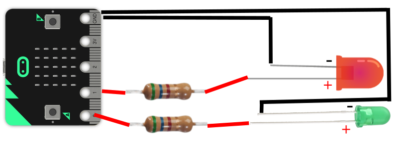
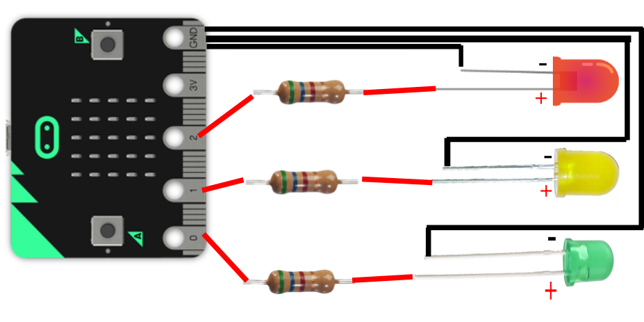

Title:   Semafor
Teacher:  True

# Semafor
## Ovládanie troch LEDiek

// LEFT


// RIGHT

*V tejto lekcii si zostrojíme funkčnú maketu svetelnej križovatky pomocou micro:bitu a červenej, žltej a zelenej LEDky.*

**Potrebné pomôcky:**
BBC micro:bit, USB kábel, počítač pripojený na internet, krokosvorky, LED diódy, rezistory, [batérie pre BBC micro:bit] 

Pracovať budeme v online prostredí [makecode.microbit.org](https://makecode.microbit.org/)

// END

!!! primary "Ako fungujú semafory?"
	
	Semafory na križovatkách sa môžu zdať ako veľmi jednoduché zariadenia, no v skutočnosti je za nimi obrovské množtvo plánovania. Viac o plánovaní svetelných križovatie si môžeš pozrieť v tomto videu (v angličtine) [https://www.youtube.com/watch?v=DP62ogEZgkI](https://www.youtube.com/watch?v=DP62ogEZgkI) 

	// LEFT

	

	// RIGHT

	Svetlá na križovatke majú zväčša 4 fázy:

	1. Svieti červené svetlo - autá musia stáť.
	2. Svieti červené aj žlté svetlo - autá sa pripravujú na jazdu.
	3. Svieti zelené svetlo - autá môžu prejsť križovatkou.
	4. Svieti žlté svetlo - autá postupne spomaľujú.

	// END

### Semafor s micro:bitom

Pre tvorbu malého modelu semaforu je potrebné zapojenie troch LED diód a ich správne naprogramovanie. V predchádzajúcej lekcii sme programovali iba 1 LED diódu na micro:bite. Pripojiť ich ale môžeme aj viac. Keď sa pozrieme na micro:bit, uvidíme, že má 3 programovateľné kolíky (anglicky "piny") označené číslami “0”, “1” a “2” a teda môžeme pripojiť až 3 rôzne svetlá. Presne toľko potrebujeme na semafor.

Pre každú z 3 LED diód platí:

*   Plus (anóda) je pripojená cez vlastný rezistor na jeden z troch programovateľných kolíkov
*   Mínus (katóda) je pripojená ku “GND”  

// NEWPAGE

#### Dve LEDky - preblikávanie medzi "zelenou" a "červenou"

Najprv si vyskúšame zostrojiť jednoduchší semafor s dvoma LEDkami (aké často bývajú pre chodcov) a budeme preblikávať medzi zelenou a červenou LEDkou.


// LEFT


*Schéma zapojenia dvoch LEDiek*

Na pripojenie LEDiek (podľa schémy) použijeme krokosvorkové kábliky a rezistory. Každú LEDku pomocou rezistora pripojíme k vlastnému kolíku - zelenú LEDku ku kolíku "0" a červenú ku kolíku "1".

Náš program by sa dal rozdeliť do 2 častí:

1. Zelenú LEDku zapneme (príkazom `digitálne zapísať kolík P0 hodnota 1`) a červenú vypneme. Následne počkáme 1 sekundu.
2. Zelenú LEDku vypneme a červenú zapneme. Opäť počkáme 1 sekundu.

// RIGHT
 
```makecode
_6TqVURRKKRDp
```

// END


// LEFT

#### Tri LEDky - plnohodnotný semafor

Pripojenie 3 LEDiek je podobné zapojeniu v predchádzajúcom kroku - každá LEDka má vlastný rezistor, ktorým je prepojená k vlastnému kolíku. Taktiež sú všetky *katódy* LEDiek pripojené ku kolíku “GND”.

// RIGHT


*Schéma zapojenia troch LEDiek*

// END

#### Program pre manuálny semafor
*Manuálny semafor* je semafor, ktorý sa ovláda tlačidlami na micro:bite - pri štarte micro:bit zasvieti červenú farbu a potom prepíname na zelenú a späť na červenú pomocou tlačidiel “A” a “B”.

Ak chceme zmeniť z červenej farby na zelenú, stlačíme tlačidlo "A". Keďže vieme, že pri tejto zmene fáz chvíľu svieti červená spolu so žltou, zapneme žltú LEDku (pripojenú ku kolíku P1), počkáme sekundu, potom vypneme červenú LEDku (kolík P2), vypneme žltú LEDku (kolík P1) a zapneme zelenú LEDku (kolík P0). 

Ak cheme naspäť zmeniť zo zelenej farby na červenú, stlačíme tlačidlo "B". Micro:bitom následne vypneme zelenú LEDku (kolík P0), zapneme žltú LEDku (kolík P1) a počkáme dve sekundy. Potom vypneme žltú LEDku (kolík P1) a nakoniec zapneme červenú (kolík P2). 

```makecode
_9jL9ccd3TCeV
```

// NEWPAGE

#### Program pre automatický semafor

Ďalší typ semaforu, ktorý si naprogramujeme, je *automatický semafor* - sám sa v stanovených intervaloch prepína. Dodržiava pri tom pravidlá, ktoré sme si popísali na začiatku tejto lekcie (prechody medzi 4 fázami). V našom prípade sa prepína každých 5 sekúnd, ale toto číslo si môžeš ľubovoľne upraviť.


```makecode
_Cq1TTzK4bb4m
```

### Kartónová konštrukcia pre semafor

// LEFT


// RIGHT


// END

Aby sme si vytvorili skutočnú maketu semaforu, použijeme obyčajný kartón, ktorý podľa fotiek vystrihneme a zlepíme tavnou pištoľou. Nožnicami (alebo vŕtačkou) následne spravíme 3 diery, do ktorých vložíme LEDky (aby lepšie držali, môžeš ich prilepiť trochou tavného lepidla).

Podobný semafor je možné si aj zakúpiť, napr.: [https://www.kitronik.co.uk/5642-stopbit-traffic-light-for-bbc-microbit.html](https://www.kitronik.co.uk/5642-stopbit-traffic-light-for-bbc-microbit.html)

### NÁPAD NA PROJEKT: Komplexná svetelná križovatka

Ako väčší projekt by bolo možné vytvoriť maketu križovatky, v ktorej by sa nachádzalo niekoľko semaforov. Tie by mohli spolu komunikovať bezdrôtovo, aby sa koordinovali, kedy ktorý semafor má svietiť na zeleno a kedy na červeno (viac o bezdrôtovej komunikácii v ďalšej kapitole).