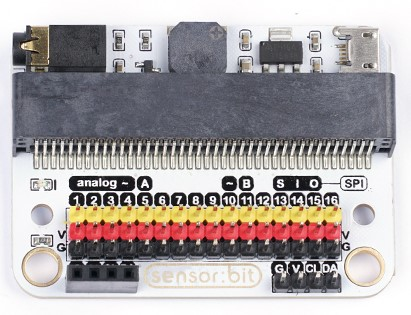

Title:   	Úvod
Subtitle:   Smart Home Kit

# Smart Home
## Úvod

Smarthome je technológia, ktorá klasickej domácnosti umožní, aby sa stala inteligentnou a automatizovanou. Táto technológia má zvyčajne automatizovaný systém na osvetlenie, kontrolu teploty a rôzne formy bezpečnosti. Existujú rôzne riešenia a technológie, ich spoločný prienik je však založený na tom, že potrebujeme sadu senzorov a nejakú riadiacu jednotku. Funkciu riadenia v našom prípade preberie micro:bit, ktorý bude v nekonečnej slučke kontrolovať vstupy získané zo senzorov a na základe vopred navolených inštrukcií bude na ne reagovať. 

### S čím budeme pracovať (sensor:bit doska, senzory) 
Modulárnosť mikropočítačovej dosky BBC micro:bit nám dáva možnosti pripojenia k špecializovaným doskám, ktoré úzke kolíky plošného spoja vyvedú na špeciálne kolíky (po anglicky "piny"), cez ktoré môžeme pomocou prepojovacích vodičov s dutinkami pripojiť rozširujúci hardvér.  

My budeme využívať "Elecfreaks sensor:bit for micro:bit". Doska sensor:bit rozširuje všetky dostupné vstupno-výstupné porty na micro:bite a vyvedie ich vo forme tzv. GVS kolíkov (Ground Voltage Signal). Doska tiež ponúka možnosť pripojenia aj cez rozhranie IIC (Inter-Integrated Circuit). To sú tie dva rady po štyroch kolíkoch na spodnej časti dosky označené ako GVClCa. Na doske je integrovaný reproduktor (bzučiak) a zvukový konektor na pripojenie slúchadiel alebo externých reproduktorov. Na realizáciu projektov sme využili senzory zo sady ELECFREAKS micro:bit Smart Home Kit. Novšia verzia dosky, vhodnej aj pre micro:bit verzie 2 navyše obsahuje port na napájanie dosky. 

// END

### V čom budeme programovať? 

Programovať budeme v prostredí makecode.microbit.org.

Na to, aby sme mohli pracovať so SmartHome Kitom, potrebujeme do prostredia makecode pridať rozšírenie, čím sa nám zobrazia nové ponuky príkazov.  V ponuke otvoríme **Pokročilé** a prejdeme do **Rozšírenia**. Dáme vyhľadať smarthome a vyberieme rozšírenie s týmto názvom.

// LEFT

// RIGHT

Do prostredia sa nám pridajú nové skupiny príkazov: 

* **Smarthome**, kde máme príkazy na prácu so senzormi. 
* **OLED**, kde sú príkazy na prácu s OLED displejom. 
* **Neopixel** pre prácu s LED svetielkom. 

// END

Prostredie máme pripravené. Potrebujeme už len  micro:bit zasunúť do senzor:bit dosky a pripojiť USB káblom k počítaču. 

 
!!! warning "Upozornenie"
	Príkazy pre smarthome sadu nie je možné prepnúť do slovenského jazyka. Existuje len ich anglická verzia. 