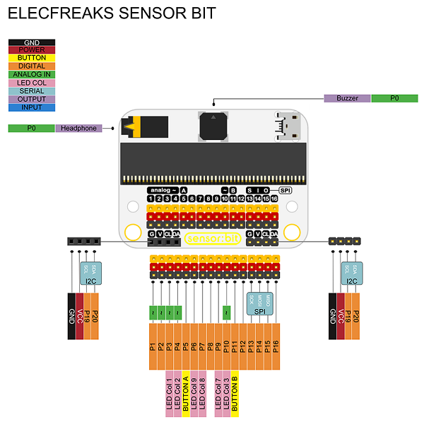

Title:   	Inteligentné osvetlenie
Subtitle:   Smart Home Kit

# Inteligentné osvetlenie

// LEFT


// RIGHT

**Čo budeme potrebovať:**  
micro:bit, sonsor:bit doska, senzor intenzity osvetlenia (light sensor), senzor intenzity zvuku (noise sensor), programovateľná LED (rainbow LED), OLED displej, prepojovacie vodiče. 

Programovať budeme v prostredí [makecode.microbit.org](https://makecode.microbit.org/).

// END

### 1. Meranie intenzity svetla
    
Najprv sa naučíme ako odmerať intenzitu osvetlenia a vypísať ju na OLED displej.

Vedeli ste, že micro:bit vie merať intenzitu osvetlenia aj bez pripojenia špeciálneho senzoru? V tejto aktivite si porovnáme oba spôsoby merania intenzity osvetlenia, a to so zabudovaným senozorom a externým senzorom zo SmartHome Kitu. Budeme vidieť hodnoty z oboch, a tak budeme môcť porovnať ich citlivosť.

#### 1.1.  Meranie so zabudovaným svetelným senzorom
    
// LEFT

Vypisovanie na zabudovaný displej micro:bita je trochu nepraktické a preto sa najskôr naučíme hodnoty vypisovať na OLED displej zo Smarthome sady. Displej musíme pripojiť na senzor:bit dosku. Na spodnej časti dosky, na ľavej strane sú 4 otvory na kolíky (GVClCa). OLED displej do nich zapojíme. Kvôli prehľadnosti nasledujúcich schém na nich OLED displej nebude zobrazovaný, ale neodpájame ho.

// RIGHT


// END

// LEFT

 Počas spustenia micro:bita musíme OLED displej inicializovať. Týmto nastavíme šírku a výšku plochy dostupnej na vypisovanie. OLED displej zo SmartHome Kitu má šírku 128 pixelov a výšku 64 pixelov. Na inicializáciu použijeme príkaz `initialize OLED with width 128 height 64` z kategórie `OLED`.

// RIGHT

```makecode-no-link
_Pjq1zfgsPPE8

```

// END

// LEFT

Keďže chceme aby sa výpis a meranie opakovalo, aby sme mali vždy aktuálnu hodnotu osvetlenia, tak použijeme nekonečnú slučku `vždy`. Výpis na displej zabezpečia príkazy `show (without newline) string`, na zobrazenie reťazca, a `show (without newline) number`, na zobrazenie čísla, z kategórie `OLED`. Použitím týchto dvoch príkazov, môžeme na displej vypísať hodnoty vedľa seba v jednom riadku. Ak by sme chceli vypisovať hodnoty pod seba môžeme použiť príkaz `show string` a `show number`, ktorý automaticky po výpise odriadkuje. Na získanie hodnoty osvetlenia z integrovaného senzora použijeme príkaz `úroveň osvetlenia` z kategórie `Vstup`.

// RIGHT

```makecode-snippet
_RRWWp824cT28
```
```makecode-link-only
_2HyUurTFUhTU
```
// END

// LEFT

Keď program nahráme do micro:bitu všimneme si, že výpis na OLED je veľmi neprehľadný, lebo nové hodnoty sa vypisujú stále za sebou, pričom staré hodnotu ostávajú na displeji. Aby sme si program sprehľadnili, musíme pridať ešte jeden príkaz na vyčistenie displeja `clear OLED display`.

// RIGHT

```makecode-snippet
_9tFU36M3WXEJ
```
```makecode-link-only
_C0dLq30w92C0
```

// END

Keď sa bude teraz zobrazovať nová hodnota, tak sa tá predchádzajúca z displeja vymaže.


!!! info "TIP"
	Výpis je teraz síce prehľadnejší, ale displej nám bliká. Bliká preto, že sa výpis realizuje vo veľkej frekvencii.
	Procesy v počítači sú totiž veľmi rýchle a keď chceme blikanie spomaliť musíme spomaliť procesy. Ak do programu dáme príkaz `pozastaviť (ms)` z kategórie `Základné` a určíme si interval v ktorom sa má OLED displej premazať a znovu vypisovať, blikanie sa spomalí. Blikanie však úplne neodstránime.
 
Keď už máme program funkčný môžeme skontrolovať hodnoty, ktoré sa vypisujú. Skúsime zakrývať rôzne časti micro:bita aby sme zistili, kde sa integrovaný senzor nachádza. Hodnoty by sa mali zmeniť v momente, keď zakryjeme LED displej na micro:bite. Micro:bit totiž nemá skutočný vstavaný plnohodnotný senzor. Meria sa len intenzita svetla dopadajúceho na vstavaný LED displej.

Skúsme ešte poslednýkrát zasvietiť na LED displej, zakryť ho, odokryť, aby sme videli, aké hodnoty sa vypisujú.

Pozorovaním by sme mali zistiť:

* Zabudovaný senzor nie je veľmi citlivý na rozptýlené svetlo.
* Senzor nám vracia hodnoty v intervale 0 – 255.

#### 1.2.  Meranie s externým senzorom intenzity svetla zo SmartHome Kitu
    
// LEFT

Teraz si môžeme porovnať hodnoty s externým senzorom. Prvýkrát si vyskúšame zapojiť senzor na senzor:bit dosku. Zoberieme svetlocitlivý senzor a prepojovací vodič (žlto-červeno-čierny). Jednu stranu zacvakneme do senzora a tú druhú stranu, kde sú len otvory nasunieme na kolík s označením 1. Dávame si pozor na farby na kolíkoch, aby išiel žltý do žltého, červený do červeného a čierny do čierneho káblika. 

// RIGHT


// END

// LEFT

Nový kód bude podobný, zmeníme len hodnotu, ktorá sa bude vypisovať. Namiesto hodnoty zo zabudovaného senzoru použijeme príkaz `value of light intensity(0-100) at P1` z kategórie `Smarthome` (hodnota zo svetelného senzora). Treba si dať pozor na správne nastavenie kolíka v parametri príkazu. My sme zapojili senzor do P1 (kolík/pin 1). Teraz môžeme program nahrať do micro:bita.

// RIGHT

```makecode-no-link
_Pjq1zfgsPPE8
```
// END
```makecode-snippet
_DTt8zFarHWoy
```

```makecode-link-only
_h5dAL0eiWP91
```


Opäť môžeme zakrývať senzor, odokrývať ho a svietiť na neho, aby sme mohli pozorovať aké hodnoty sa vypisujú.

Pozorovaním by sme mali zistiť:

* Externý senzor je citlivejší na rozptýlené svetlo.
* Snímač nám vracia hodnoty v intervale 0 – 100.

**Na ďalšie projekty budeme používať presnejší externý senzor.**

### 2.  Práca s LED svetielkom
    
// LEFT

Teraz sa naučíme ako pracovať s LED svetielkom zo SmartHome Kitu. Vyskúšame si ho naprogramovať tak, aby sme ho vedeli zapnúť a vypnúť pomocou tlačidiel na micro:bite. Môžeme si to predstaviť ako klasickú lampu, ktorú zapíname a vypíname pomocou vypínača.

Svetielko si rovnako ako svetelný senzor pomocou káblika zapojíme na senzor:bit dosku na kolík označený číslom 2. Svetlocitlivý senzor z predchádzajúcej úlohy však nemusíme odpájať, ani nemusíme mazať pôvodný kód, ktorý budeme potrebovať na ďalšiu aktivitu. Opäť dávame pozor na farby na kolíkoch a kábliku.

// RIGHT


// END

Príkazy na prácu s LED svetielkom nájdeme v kategórii `Neopixel`. Do udalosti `počas spustenia` pridáme príkaz `nastaviť strip na Neopixel at pin P0 with 24 leds as RGB (GRB format)`. Inicializáciou nastavíme kolík, do ktorého sme svetielko zapojili, u nás P2 (kolík/pin 2), a určíme počet RGB svetielok, my máme len jednu.

<div markdown="1" class="mx-auto" style="width: 80%;">
```makecode-snippet
_R1yWhPhsk2Kd
```
</div>

// NEWPAGE

V udalosti `keď sa tlačidlo A stlačí` nastavíme svetielku bielu farbu a `keď sa tlačidlo B stlačí`  farbu čiernu (čierna simuluje vypnutie). Použijeme príkaz `strip show color red` z kategórie `Neopixel` a vyberieme vhodnú farbu. Program si nahráme do micro:bita.


```makecode-snippet
_2CM6y0Ha7Tdg
```
```makecode-link-only
_F51et8HKre9w
``` 

!!! info "TIP"
	Farby si vieme nastaviť aj pomocou RGB zápisu. Kde vieme nastaviť zvlášť červenú, zelenú a modrú zložku svetla, vďaka čomu si vieme lepšie namiešať ľubovoľnú farbu. Klasické biele svetlo vznikne, keď sú všetky časti svetla na plnej intenzite `red 255 green 255 blue 255`. Vypnutie simulujeme nastavením farby na čiernu, kde všetky zložky svetla sú na minime `red 0 green 0 blue 0`. Príkaz na nastavenie RGB hodnoty `red 255 green 255 blue 255` nájdeme v kategórii `Neopixel`, kliknutím na ponuku `viac`.
	

<div markdown="1" class="mx-auto" style="width: 70%;">	
```makecode-snippet
_3uz2aULtrgeT
```
</div>

### 3.  Automatické osvetlenie
    
Automatizáciu zavedieme spojením predchádzajúcich častí. Už nebudeme svetielka rozsvecovať manuálne pomocou tlačidiel. Rozsvietime ich na základe nameranej intenzity svetla automaticky. Takto budeme v podstate simulovať automatické pouličné osvetlenie, ktoré sa zapne v momente, keď sa zotmie a vypne, keď sa rozvidnie. Hodnotu intenzity svetla pri ktorej sa svetielko rozsvieti si určíme na základe predošlého pozorovania. 

Senzor aj svetielko by sme mali mať už zapojené z predchádzajúcich aktivít, čiže nám stačí len trochu upraviť kód. Keď chceme hodnotou zo senzora použiť viackrát, je lepšie uložiť si hodnotu do samostatnej premennej, aby sme pri ďalších krokoch používali rovnakú hodnotu a aby sme nemuseli merať viackrát v jednom cykle. Preto si na začiatku nastavíme premennú, do ktorej si budeme nameranú intenzitu svetla ukladať. Premennú si vytvoríme v kategórii `Premenná`, kde klikneme na `Vytvoriť premennú` a zadáme jej meno. Hodnotu premennej nastavíme cez príkaz `nastaviť premennú na 0`. Tento príkaz vložíme na začiatok cyklu `vždy`. Na voľné miesto vložíme príkaz `value of light  intensity(0-100) at pin P1`.

<div markdown="1" class="mx-auto" style="width: 70%;">	
```makecode-snippet
_d7gK7j3DM0Tj
```
</div>

// LEFT

Do výpisu na pripojený displej môžeme namiesto príkazu merania dať zobrazovať hodnotu premennej, v ktorej je intenzita svetla už uložená.

// RIGHT

```makecode-snippet
_P87FPyAzFcUy
```

// END


// LEFT


A teraz sa zamerajme na časť automatizácie. Svetlo sa bude automaticky zažínať na základe vopred navolenej úrovni. Môžeme si to sformulovať napr. “ak je intenzita osvetlenia pod nejakou hodnotou, zapneme svetielko, inak ho vypneme”. Pridáme rozhodovací príkaz `ak ... potom ... inak ...` z kategórie `Logika` pomocou ktorého budeme porovnávať nameranú intenzitu svetla s hodnotou, ktorú sme si určili. Keď bude intenzita svetla nižšia ako nami určená hodnota, bude to znamenať, že sa zotmelo svetlá treba zapnúť. Naopak, ak bude intenzita svetla vyššia, tak to znamená, že sa už rozvidnelo a svetlá sa môžu zhasnúť. Príkaz na porovnávanie hodnôt `0 < 0` nájdeme tiež v kategórii `Logika`. Príkazy na zapnutie a vypnutie svetla môžme zobrať z príkazov `keď sa tlačidlo A stlačí` a `keď sa tlačidlo B stlačí`, ktoré môžeme následne vymazať. Program si nahráme do micro:bita.

// RIGHT

```makecode-snippet
_RcUPU4c4oRpk
```
```makecode-link-only
_aWJeDv126Ec7
``` 

// END

V tejto časti sme sa naučili, že automatizácia funguje tak, že systém v nekonečnej slučke meria vstupy so senzora. V prípade, ak hodnota zo senzora splní žiadanú podmienky, vykoná sa predprogramovaná úloha. Smarthome však nie je len o automatizácii, ale aj o efektivite. Keď máme svetlo doma, nepotrebujeme aby svietilo celú noc, minuli by sme zbytočne veľa elektriny. Aby sme to zefektívnili pridáme ďalší podnet, na ktorý sa svetlo zapne. Väčšinou sa používa senzor pohybu, ale keďže ten v sade Smarthome Kit nie je, použijeme senzor intenzity hluku.

### 4.  Meranie intenzity hluku
    
// LEFT

Ani teraz nemusíme nič odpájať, ani mazať kód. Ďalší komponent, ktorý si pridáme na senzorickú dosku je senzor intenzity zvuku. Zapojíme si ho na ďalší voľný kolík označený číslom 3. 


// RIGHT


Tak ako sme v predchádzajúcej úlohe vytvárali premennú pre hodnotu intenzity svetla, tak teraz vyrvoríme premennú pre intenzitu hluku.

```makecode-snippet
_YofHXsXsvg4R
```
K tomu pridáme výpis hodnoty na OLED displej. Navyše pred výpis pridáme len príkaz `insert  newline`, aby sme písali do nového riadku.

```makecode-snippet
_Rid87Cc2m0vy
```
```makecode-link-only
_Vh7cgy8x83ay
``` 


Keď si program nahráme do micro:bita môžeme zase experimentovať s citlivosťou a možným rozsahom nameraných hodnôt.

Pozorovaním by sme mali zistiť: 

*  Zvukový senzor meria hodnoty v decibeloch (dB). Nerozpoznáva slová, ale reaguje len na hlučnosť v okolí senzora.   
*  Snímač nám vracia hodnoty v intervale 0 – 100. 

// END


!!! info "TIP"
	Niektoré kolíky majú špecifické funkcie. Napríklad kolík číslo 3 je prepojený s prvým stĺpcom LEDiek na displeji micro:bita. Preto ak chceme aby nám senzor pracoval presnejšie mali by sme vypnúť LED displej na micro:bite. Dá sa to pomocou príkazu
	`zapnúť LED nepravda` zo sekcie `LED` v časti `viac`.


<div markdown="1" class="mx-auto" style="width: 30%;">	
```makecode-snippet
_csM4WwEguhLs
```
</div>





### 5.  Automatické osvetlenie reagujúce na intenzitu svetla aj zvuku
    

Keď už máme senzor intenzity zvuku zapojený, tak môžeme prejsť na zefektívnenie automatického osvetlenia.  Keďžedoma nepotrebujeme, aby bolo svetlo zapnuté celú noc, tak zavedieme ďalšiu podmienku rozsvecovania. Hladinu pre intenzitu zvuku si určíme na základe predošlého pozorovania. Na konci by sme mali mať osvetlenie, ktoré sa po zotmení pri zvýšenom hluku zapne na niekoľko sekúnd a potom sa zhasne. Určite ste také niečo videli aj v reálnom živote, či už máte také svetlo na pohyb pred domom, či vo vchode bytovky. Vždy keď okolo neho prejdete, zasvieti sa a o pár sekúnd sa zhasne. Toto je rovnaké len namiesto toho, že svetlo zaregistruje, že prídete, tak sa rozsvieti, až keď tlesknete, alebo nejak zvýšite intenzitu zvuku.

// LEFT

LED svetielko, senzor intenzity svetla a senzor intenzity hluku by sme mali mať pripojené na senzor:bit doske. Do kódu nám už len stačí pridať ďalšiu podmienku `ak ... potom...`, kde budeme porovnávať odmeranú hodnotu zo senzoru intenzity hluku s nami zvolenou hodnotou. Keď bude intenzita zvuku vyššia než zvolená hodnota, tak sa svetlo zapne na 5 sekúnd a zase sa vypne. Toto však chceme aby sa stalo len ak je tma, čiže to nesmieme zabudnúť vložiť do našej predošlej podmienky, kde kontrolujeme, či už je tma. Vetvu inak môžeme odstrániť pomocou tlačidla mínus.

// RIGHT

```makecode-snippet
_97kR09X32KK4
```
```makecode-link-only
_2zuKqA5p1FHK
```
// END

Program si nahráme do micro:bita.

V tejto časti sme sa naučili, že automatizácia môže podliehať viacerým podmienkam. V našom prípade sa svetlo zapne len ak je vonku tma a zároveň bol vydaný zvukový povel (potlesk, dupnutie, či slovo). Aj to len na krátky čas. Inak nemá svietenie význam.
