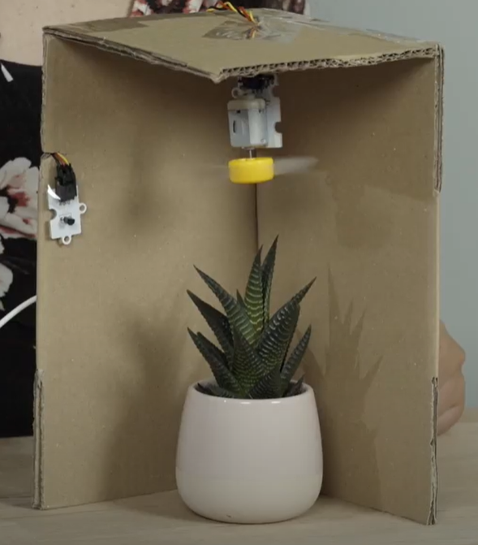

Title:   	Inteligentná klimatizácia
Subtitle:   Smart Home Kit

# Inteligentná klimatizácia

// LEFT



// RIGHT

**Čo budeme potrebovať:**  
micro:bit, sensor:bit doska, jednosmerný motor (DC motor) s vrtuľkou, teplotný senzor (temperature sensor), OLED displej, prepojovacie vodiče.  

Programovať budeme v prostredí [makecode.microbit.org](https://makecode.microbit.org/). 

// END

### 1. Spúšťanie “klimatizácie” 
   
// LEFT

Teraz sa naučíme ako pracovať s našou klimatizáciou, čo je to jednosmerný motor, na ktorom je pripojená vrtuľka. Motor si káblikom (žlto-červeno-čierny) pripojíme k doske na kolík číslo 1. Jeden koniec zacvakneme do motorčeka a druhú stranu, kde sú dierky nasadíme na kolíky. Dávame pozor, aby išiel žltý káblik na žltý kolík, červený na červený a čierny na čierny.

Jednosmerný motor má len dva stavy a to buď sa krúti alebo sa nekrúti. Týmto stavom si priradíme čísla a to 0 pre stav kedy stojí a 1 pre stav kedy sa točí. Tieto hodnoty si budeme digitálne zapisovať na kolík, kde máme motor zapojený. Hodnoty budeme zapisovať pri stlačení tlačidla, na vstup `keď sa tlačidlo A stlačí` motor zapneme a `keď sa tlačidlo B stlačí` ho vypneme. Budeme tak simulovať zapnutie a vypnutie “klimatizácie“ manuálne cez vypínač. Keď máme len dva stavy, kde zapisujeme buď jednotku alebo nulu, tak požívame príkaz `digitálne zapísať kolík P1 hodnota 0`, ktorý nájdeme v sekcii `Pokročilé – Kolíky`. Motor máme zapojený na P1 (kolík/pin 1), čiže to meniť nemusíme. Keď zapisujeme digitálne hodnotu na kolík, tak sa v skutočnosti na kolík privedie nejaké napätie. Ak zapisujeme hodnotu 0, neprivádza sa žiadne napätia alebo len veľmi nízke, čiže motor sa nezapne a ak 1, tak sa privedie na kolík vyššie napätie a motor sa zapne.

// RIGHT


// END


```makecode-no-link
_5s0MrdXqV76T
```
```makecode-link-only
_5s0MrdXqV76T
``` 
!!! info "TIP"
	Ak vám motor nepôjde zapnúť, skúste k micro:bitu zapojiť aj batérie.


### 2. Meranie teploty
    

Teraz sa naučíme ako odmerať teplotu a vypísať ju na OLED displej.
Vedeli ste, že micro:bit má v sebe zabudovaný aj teplotný senzor? V tejto aktivite nebudeme používať, len ten čo máme v SmartHome Kite, ale skúsime si aj prácu s tým zabudovaným. Pokúsime sa ho nájsť a vysvetlíme si ako pracuje. Potom si budeme vedieť hodnoty z oboch senzorov porovnať.

#### 2.1.  Meranie so zabudovaným teplotným senzorom

// LEFT

Klimatizáciu môžeme nechať pripojenú a ani kód nemusíte mazať, budeme do neho dopĺňať. Na spodnej časti dosky, na ľavej strane sú 4 otvory na kolíky (GVClCa). OLED displej do nich zapojíme. Kvôli prehľadnosti nasledujúcich schém na nich OLED displej nebude zobrazovaný, ale neodpájame ho.

// RIGHT


// END

// LEFT

OLED displej potrebujeme inicializovať.


Keďže chceme, aby sa meranie a výpis teploty opakovalo kým bude micro:bit pripojený na napájanie, budeme ukladať odmeranú teplotu do premennej. Preto potrebujeme cyklus `vždy`. Premennú si vytvoríme v kategórii `Premenná`, kde vyberieme príkaz `Vytvoriť premennú` a zadáme meno premennej. Vyberieme príkaz `nastaviť premennú na 0`. Namiesto nuly vložíme príkaz `teplota(℃)` z kategórie `Vstup`, ktorý vloží do premennej nameranú teplotu zo zabudovaného senzora. 
Na výpis na displej použijeme príkaz na zobrazenie reťazca `show (without newline) string` a príkaz `show (without newline) number` na zobrazenie čísla. Obe z kategórie `OLED`. Príkazy nám vedľa seba zobrazia informáciu o tom, čo meriame aj nameranú hodnotu. Ak by sme chceli vypisovať hodnoty pod seba môžeme požiť príkaz `show string` a `show number`, ktorý automaticky po výpise odriadkuje. Vypisovať budeme premennú v ktorej máme uloženú teplotu. Nemôžme zabudnúť na príkaz `clear OLED display`, ktorý nám zabezpečí že sa displej vždy vyčistí a zapíše sa nová hodnota. Ak chceme znížiť intenzitu blikania použijeme príkaz `pozastaviť (ms) 100` z kategórie `Základné`. Takýto kód si môžeme stiahnuť do micro:bita.

// RIGHT


```makecode-no-link
_UKR9JY6aVTJm
```

```makecode-no-link
_dyrRtAFXdMq0
```
```makecode-link-only
_doc9JLXYTDrq
``` 
// END

Keď už máme program funkčný môžeme pozrieť hodnoty, ktoré vypisuje. Skúsime zahrievať rôzne časti micro:bita aby sme zistili, kde sa senzor nachádza. Hodnoty by sa mali zmeniť keď budeme dlhšie senzor zahrievať prstom. 
Mali by sme zistiť, že teplota sa mení keď zahrievame procesor. Je to preto lebo micro:bit v  skutočnosti nemá žiaden reálny senzor. Procesor, ktorý je zabudovaný v micro:bite,  pracuje “za studena” a tak má len takú teplotu aká je teplota okolia. Micro:bit teda len meria teplotu procesora. V prípade, ak zakryjeme prstom procesor, zvýši sa aj teplota „senzora“.  

Pozorovaním by sme mali zistiť:

* Teplota procesora je vždy o pár stupňov (cca o 4°C) vyššia ako teplota prostredia. 
* Snímač nám vracia hodnoty v intervale -5 až 50°C. 

#### 2.2.  Meranie s externým teplotným senzor zo SmartHome Kitu

// LEFT

Teraz si môžeme porovnať hodnoty s externým senzorom. Senzor si káblikom zapojíme na kolík 2. Dávame si pozor na farby na kolíkoch, aby išiel žltý do žltého, červený do červeného a čierny do čierneho. 

<div markdown="1" class="mx-auto" style="width: 50%;">	

</div>

// RIGHT

Kód bude podobný, zmeníme len hodnotu, ktorú ukladáme do premennej. Namiesto hodnoty zo zabudovaného senzoru použijeme príkaz `value of temperature (°C ) at P2` (hodnota zo svetelného senzora) z kategórie `Smarthome`, kde nastavíme kolík, na ktorý sme zapojili senzor, u nás P2 (kolík/pin 2). Program si nahráme do micro:bita.

```makecode-snippet
_952eve7XCP3R
```
```makecode-link-only
_R241DbJCHVHc
``` 
// END

Zase môžeme zahrievať senzor, aby sme mohli pozorovať aké hodnoty sa vypisujú. 
Pozorovaním sme mali zistiť, že externý senzor je presnejší a na teplotu reaguje citlivejšie.  
**Na ďalšie projekty budeme používať presnejší externý senzor.**

### 3. Automatické spúšťanie “klimatizácie” 
    
Pri automatizácii zase spojíme všetky časti, čiže manuálne spúšťanie motora nahradíme podmienkou automatického zapnutia. Podmienku, pri akej teplote sa spustí “klimatizácia” si určíme podľa predošlého pozorovania. Po dosiahnutí určitej teploty sa motorček na niekoľko sekúnd zapne a zase vypne, toto sa bude opakovať, až kým sa teplota nezníži pod nastavenú hodnotu.

// LEFT

Zase nemusíme nič odpájať ani vymazať kód. Do kódu si pridáme len podmienku, kde budeme porovnávať teplotu s nami určenou hodnotou, ktorú si ideálne určíme na základe pozorovaní. Hodnota by mala byť o niečo vyššia ako teplota prostredia ale nie moc vysoká, aby sme vedeli senzor na takú teplotu zahriať a tak si vyskúšať, či naše riešenie funguje. Na podmienku použijeme príkaz `ak ... potom... ` z kategórie `Logika`, pomocou ktorého budeme porovnávať nameranú teplotu s hodnotou, ktorú sme si určili. Príkaz na porovnávanie `... > ...` nájdeme tiež v kategórii `Logika`. Keď bude teplota vyššia ako nami určená hodnota, bude to znamenať, že je moc teplo. Vtedy pomocou príkazu `digitálne zapísať kolík P1 hodnota 1` motor na 5 sekúnd zapneme, na čo použijeme príkaz `pozastaviť (ms) 5000` , a potom ho zase vypneme. Príkazy na zapnutie a vypnutie motora môžeme zobrať z príkazov `keď sa tlačidlo A stlačí` a `keď sa tlačidlo B stlačí`, ktoré môžeme následne vymazať. Zapnutie  “klimatizácie”  môžeme signalizovať nejakou melódiou príkazom `spustiť melódiu ba ding opakovanie raz` z kategórie `Hudba`.

// RIGHT

Melódia sa prehrá cez zabudovaný buzzer na senzor:bit doske, ktorý je od výroby pripojený k P0 (pin 0). Keď máme program hotový, nahráme si ho do micro:bita.

```makecode-snippet
_gVzatrfV1KKV
```
```makecode-link-only
_2C0EvpJMf3yR
``` 
// END

V tejto časti sme si overili, že automatizácia musí prebiehať v slučke, v ktorej sa reaguje na hodnoty zo senzora. Podľa hodnoty z teplomera sa automaticky na kolík zapisuje buď hodnota 1 alebo hodnota 0.  