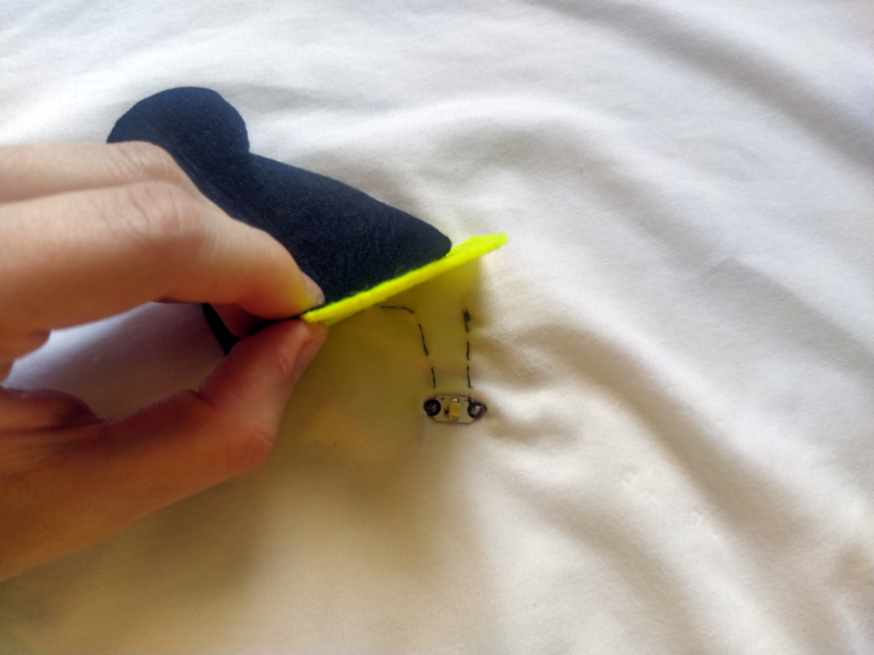

Title:   	Svätojánska Muška
Teacher:	True

# Svätojánska Muška
## 	Wearables (nositeľná elektronika)

// LEFT


// RIGHT

Poznáte zviera, ktoré má krídla, lieta v noci a so sebou nosí tzv. lampášik, ktorý svieti? (Svetluška svätojánska, ľudovo nazýva svätojánska muška)

#### Tričko so svetluškou

Spojme svetlušku a nositeľnú elektroniku, o ktorej sme si už hovorili a vytvorme tričko s nositeľnou elektronikou, kde sa bude nachádza svetluška, ktorej lampášik bude svietiť po tom, čo stačíme tlačidlo na BBC micro:bite.

// END

!!! info "Pár zaujímavostí"

	- Svetluška svätojánska sa nazýva preto, lebo ju zvyčajne vidieť na sviatok sv. Jána, 24. júna.
	- Svetlušky na našom území svietia žltou farbou, v iných častiach Zeme ich však možno nájsť svietiť aj modrou či červenou farbou.
	- Svetlušky v sebe majú luciferín, ktorý oxidáciou vyžaruje svetlo, a preto svetlušky svietia.


// LEFT

#### Čo budeme potrebovať?

*   BBC micro:bit
*   MI:power board
*   elektrovodivá niť
*   ihla
*   LED diódy
*   svorky
*   tričko
*   plsť (čierna, žltá)
*   chlpatý drôtik
*   pohyblivé očká
*   trblietavé lepidlo

// RIGHT


// END

Najskôr potrebujeme vystrihnúť z plste svetlušku. Telo svetlušky bude z čiernej plste vrátane prvého páru krídel, tzv. kroviek. Lampášik, ktorý bude svieti, bude zo žltej plste, ktorá zvýrazní efekt LED diódy. Najskôr si vystrihneme hlavu s hruďou, ktoré by mali byť dostatočne široké na to, aby pod nimi nebolo vidieť micro:bit. Následne si vystrihneme krovky, ktoré sú symetrické, čiže obe krídla budú rovnaké a budú smerovať nadol. Lampášik sa čiastočne skryje pod čiernu hruď, preto je dôležité, aby časti, ktoré budeme spájať, boli rovnako široké. Okrem toho si musíme pamätať, že pod lampášikom bude LED dióda, ktorú nesmie byť vidno vrátane elektrického obvodu z nití.

// NEWPAGE

#### Šitie

Zoberieme si MI:power board a spojíme s micro:bitom pomocou skrutiek. Micro:bit musí byť pevne zaskrutkovaný, pretože skrutky a matice predstavujú elektrický obvod medzi batériou a micro:bitom. Následne priložíme svorky k GND a ľubovoľnému programovateľnému pinu, napríklad 0. Tričko prevrátime naruby, teda vnútornou stranou, kde priložíme micro:bit spolu so svorkami. Pozor, svorky zapájame k micro:bitu, ktorý umiestňujeme smerom dopredu tak, aby sme mohli stláčať tlačidlá.

Následne začíname šiť. Odstrihneme si asi 15 cm vodivej nite, prevlečieme cez ihlu a na konci spravíme uzlík. Začíname od svorky, ktorá je upevnená k GND. Keďže nechceme, aby nám svorka vypadla z trička, prišívame ju viacerými ťahmi. Pri svorke sa nachádza krúžok, ktorým niť aspoň 2-krát obídeme. Následne šijeme predným stehom.

!!! primary "Predný steh"

	Predný steh patrí k základným stehom. Vytvoríme ho tak, že šijeme akúsi rovnú priamku, pričom ihlu zapichujeme raz smerom hore, potom smerom dole. Vieme sa na predný steh pozrieť z programátorského pohľadu? Áno, ide o cyklus, kde sa šije “raz hore - raz dole”, pričom sa to opakuje niekoľkrát.

#### Prišívame LED diódu

// LEFT

LED diódu prišívame na líc, to znamená časť trička, ktorú bude vidieť. V našom prípade to znamená, že svorku na micro:bit sme prišili na vnútornú stranu trička a LED diódu prišívame na vonkajšiu. Keď šijeme od pinu GND, tak prišívame niť k mínusu a následne šitie zakončíme uzlíkom a zvyšnú niť odstrihneme. Nepokračujeme k plusu! \
 \
Novú niť začíname s uzlíkom pri svorke micro:bitu, ktorá je pripojená na pin 0 a predným stehom pokračujeme k LED dióde k plusu. Zakončíme uzlíkom. Pozor, stehy sa nesmú prekrývať, inak môže dôjsť k skratu.

// RIGHT


// END

#### Programujeme

// LEFT

Keď máme elektrické obvody našité, pripojíme micro:bit k počítaču cez USB kábel. Potrebujeme naprogramovať, aby LED dióda svietila vtedy, keď stlačíme tlačidlo B. Môžeme pracovať v blokovom prostredí Makecode. Z kategórie _Vstup _ vyberieme príkaz _keď sa tlačidlo A stlačí_ a namiesto tlačidla A zmeníme tlačidlo B. Teraz vieme, že keď sa udeje niečo, keď stlačíme B. Zatiaľ sa však neudeje nič. Potrebujeme LED diódu zapnúť. V ponuke _Pokročilé_ vyberieme príkaz _digitálne zapísať kolík P0 hodnota 0_. Kolík P0 znamená, že svorku máme prichytenú na pine 0. Hodnota 0 ukazuje, že práve nepreteká elektrický prúd, čiže LED dióda nesvieti. To potrebujeme zmeniť na hodnotu 1, teda LED dióda svieti. Je na nás, ako dlho chceme, aby LED dióda svietila, môžeme si však nastaviť z kategórie _základné_ príkaz _pozastaviť (ms) 100_. Keďže sa príkaz udáva v milisekundách, ak chceme, aby LED dióda svietila 5 sekúnd, znamená to zmeniť hodnotu na 5000. Následne môže LED dióda zhasnúť, teda skopírujeme príkaz _digitálne zapísať kolík P0 hodnota 1_ a zmeníme hodnotu na 0.

// RIGHT

```makecode
_P4p7YwWFdaV5
```

// END

Po stiahnutí programu do micro:bitu pripojíme svorky a následne skontrolujeme, či LED dióda svieti. Ak áno, môžeme prejsť k poslednému kroku, svätojánskej muške.

// LEFT

#### Svätojánska svetluška

Plsť, ktorú máme už vystrihnutú, si môžeme ručne našiť obyčajnou niťou alebo ju nalepiť priamo na tričko. Začíname lampášikom, na ktorý nanesieme lepidlo po obvode a priložíme k LED dióde tak, aby sme ju zakryli lampášikom (žltou plsťou). 

Následne lepíme krovky, ktoré sa vzájomne prekrývajú a k tomu vytvoríme z chlpatého drôtu dve krídla, ktoré taktiež nalepíme. Na to pridávame telo svetlušky, na ktorú sme nalepili tykadlá z chlpatého drôtu. Posledným krokom je nalepenie pohyblivých očí a k tomu môžeme na tričko nalepiť žlté trblietky okolo lampášika. Svietiaca svetluška je na svete!

// RIGHT



// END


