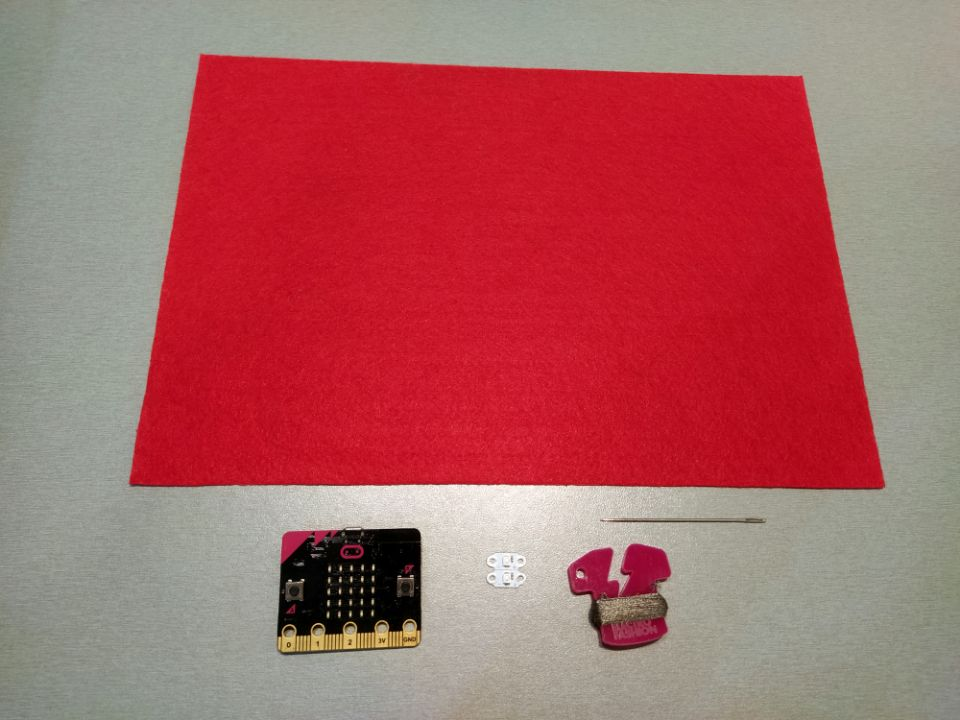
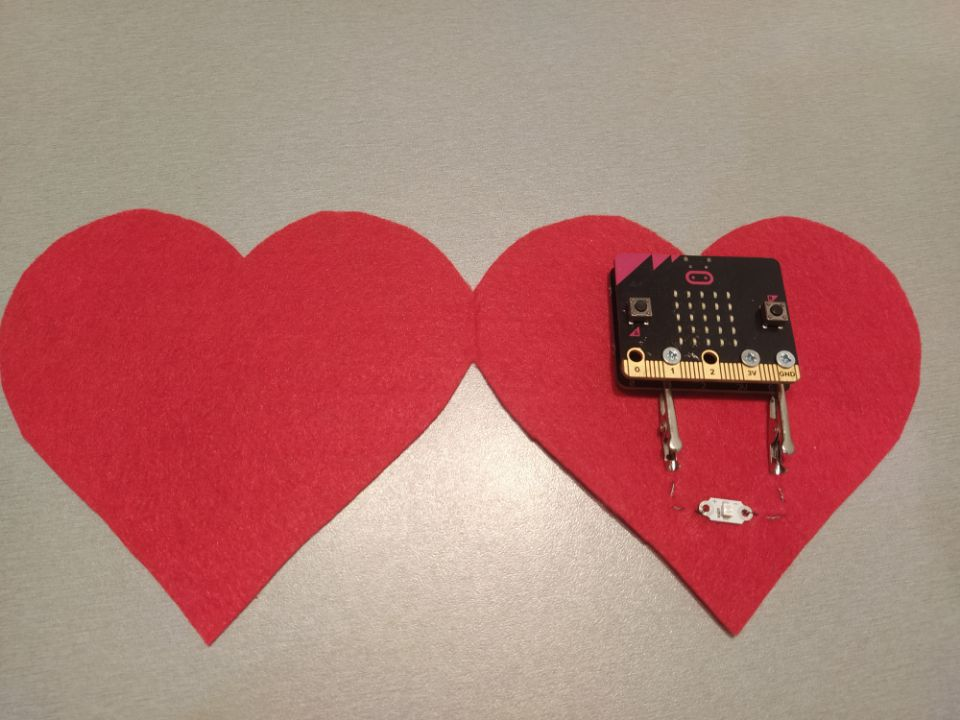

Title:   	Valentínsky odkaz
Teacher:	True

# Valentínsky odkaz
## 	Wearables (nositeľná elektronika)

// LEFT


// RIGHT

Už ste niekedy písali alebo dostali valentínsky odkaz? Vraj keď niečo darujeme, tešíme sa z toho ešte viac, akoby sme niečo dostali. Je to podľa vás pravda?

Valentínsky odkaz môžeme darovať komukoľvek a nemusí tam byť napísané “Ľúbim Ťa”. Skúsme si vytvoriť taký odkaz, ktorý môžeme darovať aj svojim kamarátom/kamarátkam. Každý má rád prekvapenia, preto ich skúsme prekvapiť nielen odkazom, ale aj tým, že odkaz bude v micro:bite, ktorý sa bude zapínať LEN vtedy, keď otvoríme pohľadnicu.

// END

// LEFT



// RIGHT


// END


// LEFT

### Čo budeme potrebovať

*   BBC micro:bit
*   USB kábel
*   MI:power board
*   nositeľné LED diódy
*   ihla
*   elektrovodivá niť
*   plsť
*   trblietavé lepidlo
*   nožnice

// RIGHT

### Základné tvary

Pohľadnica môže mať rôzny tvar, napríklad obdĺžnik, štvorec, štvorlístok či srdce. Mala by spĺňať takéto pravidlá:

*   dá sa zatvoriť
*   oba geometrické útvary sú v jednej časti spojené
*   oba geometrické útvary sú rovnako veľké

Pri strihaní stačí, aby sme si plsť preložili na polovicu a vystrihneme si želaný tvar. Na obrázku vidíte srdce. Keď preložíme plsť naspäť, musia sa obe srdcia dotýkať.

// END

// NEWPAGE

// LEFT

#### Zapájanie LED diód

K micro:bitu pripojíme MI:power board s batériou. Pozor! Krokosvorky pripájame k MI:power board a k pripojené piny musia obsahovať skrutky a matice. To znamená, že na doske bude pretekať elektrický prúd len v tých pinoch, ktoré sú prepojené s micro:bitom. Krokosvorky slúžia k tomu, aby sme si v prípade potreby mohli micro:bit vybrať a opätovne ho použiť. Keby sme si našili priamo piny, v prípade odobratia micro:bitu by sme museli porušiť celý elektrický obvod.

LED diódu zapájame tak, že šijeme z krokosvorky GND do mínusovej časti LED-ky a ukončíme šitie uzlíkom. Nové šitie začíname v krokosvorke pinu 1, pokračujeme predným stehom a ukončíme ho uzlíkom v plusovej častí LED diódy.

// RIGHT



// END

// LEFT

### Programovanie

Chceme, aby micro:bit vykonával niečo len vtedy, keď sa pohľadnica otvorí. Musíme teda merať intenzitu osvetlenia. Keďže nemáme takýto senzor, použijeme LED displej zabudovaný do micro:bita, ktorý meria dopadajúce svetlo na LED displej. Hodnota osvetlenia sa pohybuje od 0 do 255, pričom 0 je úplná tma a 255 najjasnejšie svetlo.

Kedy budeme merať úroveň osvetlenia? Stále, pretože nevieme, kedy pohľadnicu otvoríme. Použijeme cyklus _vždy_ a do nej podmienku _ak pravda potom inak_ z kategórie _logika_. Podmienke musíme určiť, čo má sledovať. Využijeme opäť kategóriu _logika_ a vyberieme porovnávanie _0 = 0_. Okrem toho vyberieme z kategórie _vstup_ _úroveň osvetlenia_. Budeme sa pýtať, či úroveň osvetlenia má nejakú hodnotu, napríklad 20. Nulu nevyberáme pre to, že pri zatvorenej pohľadnici nemáme zaručené, že tam bude úplná nula. Teda ak úroveň osvetlenia je väčšie, prípadne rovné 20, bude sa niečo vykonávať. Inak sa nebude vykonávať nič.

// RIGHT

```makecode
_4YXMgXHe6cPq
```

// END

// LEFT

#### Búšenie srdca (cyklus v cykle)

Keďže pohľadnica je v tvare srdca, chceme, aby po otvorení blikala LED dióda ako srdce. Teda 2-krát za sebou a potom väčšia pauza. Vytvoríme si cyklus _opakovať 2-krát_ a blikneme LED diódou pomocou príkazov _digitálne zapísať kolík P1 hodnota 1, pozastaviť (ms) 150, digitálne zapísať kolík P1 hodnota 0, pozastaviť (ms) 150_. Takto máme 2 bliknutia za sebou. Ešte potrebujeme väčšiu pauzu a to vytvoríme pauzou za cyklom. Následne_ _sa dohodneme, koľkokrát chceme takéto búšenie srdca zopakovať. Povedzme, že trikrát a pridávame cyklus _opakovať 3-krát_. Cyklus s pauzou vložíme do cyklu. Koľkokrát nám LED dióda blikne? 3 * 2 = 6-krát.

// RIGHT


// END

Pokiaľ chceme použiť LED displej na odkaz, použijeme z kategórie _základné_ upravený príkaz _zobraziť reťazec “Si naj”_. Samozrejme, odkaz je len na nás. Program stiahneme, môžeme si ešte trblietavým lepidlom odkaz skrášliť a valentínsky odkaz darujeme.


Program v pohľadnici sa vykonáva stále. Podstatné je, že LED dióda začne blikať na spôsob búšenia srdca a zobrazí odkaz len vtedy, keď otvoríme pohľadnicu. Inak sa nevykonáva žiadny príkaz.
