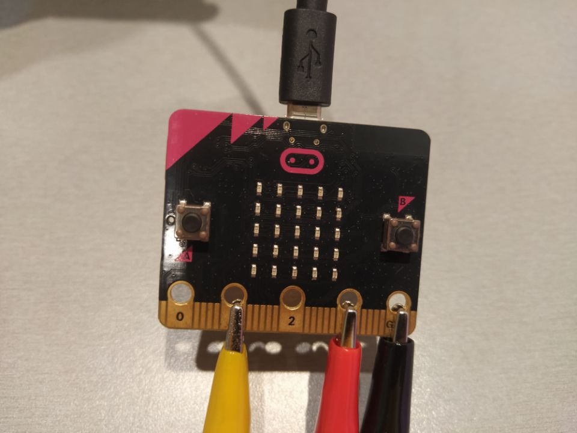
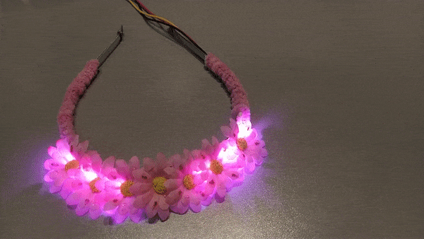

Title:   	Čelenka s LED pásikom
Teacher:	True

# Čelenka s LED pásikom
## 	Wearables (nositeľná elektronika)

// LEFT


// RIGHT

Určite poznáte svietiace čelenky. Zamýšľali ste sa nad tým, že by ste si vytvorili svietiacu čelenku podľa toho, aká sa vám páči? A naprogramovali by ste ju podľa vlastného gusta? Skúsme si spolu.

**Čo budeme potrebovať:**

*   čelenka
*   BBC micro:bit
*   USB kábel
*   LED pásik
*   batéria
*   dekorácie:
    *   kvietky, trblietavé lepidlá, chlpatý drôt, ligotavé kruhy

// END

// LEFT



#### LED pásik

LED pásik, prípadne NeoPixel pásik, je sled za sebou idúcich LED diód v paralelnom zapojení. Pri NeoPixel pásiku môžeme programovať každú LED diódu individuálne a nastavovať jej farbu a intenzitu svetla. Ako sa pripája?


*   čierny alebo biely káblik pripojíme k Zemi, teda pinu GND
*   červený káblik pripojíme k stálemu napätiu 3V
*   žltý alebo zelený káblik znamená dátový tok, teda inštrukcie, ktoré určujú jednotlivým LED diódam, ako sa majú správať. Pripájame ho k programovateľným pinom.

// RIGHT


#### Čelenka

Zoberieme si čelenku a LED pásik. Z vnútornej strany LED pásika máme žltú fóliu, ktorú keď odstránime, môžeme nalepiť na čelenku bez toho, aby sme použili lepidlo. LED pásik lepíme symetricky na stred a kábliky necháme zatiaľ voľne.


// END

// NEWPAGE

// LEFT


// RIGHT

#### Dekorácia čelenky

Aby nebolo vidno LED pásik, medzi LED pásik nalepíme obojstrannú lepiacu pásku a na ňu ukladáme kvietky. Pokiaľ páska nedrží, je možné na ňu pridať lepidlo a tak položiť kvietky. Pre zvýraznenie efektu odporúčame použiť trblietavé lepidlo, čím sa budú kvietky jemne ligotať pri svietení LED pásika.

Keďže potrebujeme kábliky “poupratovať”, použijeme chlpatý drôt, ktorým kábliky pripevníme k bočnej strane čelenky a tým ich zamaskujeme. To isté spravíme aj na druhej strane bez káblikov, aby čelenka pôsobila symetrickým dojmom. Micro:bitom môžeme s napájaním zamaskovať napríklad tak, že si ho dáme vzadu za tričko voľne visieť.

// END

// LEFT

### Programujeme

Na začiatku potrebujeme pridať Rozšírenie - vo výbere príkazov klikneme vľavo dole na kategóriu _Pokročilé_ a následne na “Rozšírenia”. Do vyhľadávania napíšeme “neopixel” a kliknite na nájdené rozšírenie.

Najskôr si vytvoríme premennú z kategórie _premenná._ Nazvime si ju “led_pasik” a vyberieme príkaz _nastaviť led_pasik na Neopixel at..._z kategórie NeoPixel. Musíme si určiť, kam sme zapojili dátový káblik, napríklad na programovateľný pin P1. Ďalším parametrom je počet LED diód, ktorých máme 8. Posledným parametrom je formát, ten môžeme nechať na RGB, teda červená - zelená - modrá. Tento príkaz stačí nastaviť na začiatku spustenia.

Následne pracujeme s cyklom _vždy._ Z kategórie _NeoPixel_ vyberieme podkategóriu _More_, kde vyberieme príkazy _led_pasik set pixel color at 0 to 0 _ a _ red 0 green 0 blue 0_. Príkazy spojíme tak, že príkaz RGB vložíme do druhej hodnoty za _to_. Takto nastavíme LED pásik na pozícii 0 s farbou RGB.

#### Farby

Môžeme si vytvoriť vlastné farby, pričom volíme hodnoty od 0 do 255. Vkladaním náhodných čísel dostaneme rôzne farby, z ktorých si môžeme vybrať, prípadne si vyhľadať na internete napr. ružovú alebo magenta a nájdeme si jednotlivé hodnoty spektra RGB. Pri ružovej je to R 255 G 20 B 147.

// RIGHT

```makecode-no-link
_T8YMCpdxkJ67
```

```makecode-no-link
_FF6J5u1d8HAW
```

```makecode-link-only
_e0KhuPXxfUYK
```

// END


#### Postupné symetrické rozsvietenie LED pásika

LED pásik chceme rozsvietiť tak, aby sme začali od prvej a poslednej LED diódy, následne sa budú rozsvecovať po susednej línii a posledné LED diódy sa rozsvietia v strede. Znamená to, že si LED pásik v mysli rozdelíme na polovicu a spojíme pozície, ktoré chceme spolu rozsvietiť. Pozor, prvá LED dióda má pozíciu 0, posledná má pozíciu 7:

* Najprv sa rozsvieti 0. a 7. LEDka
* Potom 1. a 6. LEDka
* Potom 2. a 5. LEDka
* Nakoniec 3. a 4. LEDka

Možno si všimnúť, že na jednej strane pridávame, kým na druhej strane uberáme. Teda x + 1 a y - 1.

Keď si príkazy pridáme do cyklu _vždy_, zistíme, že nám LED pásik nesvieti. Musíme ho postupne rozsvecovať pomocou príkazu _led_pasik show._ Aby sme dosiahli efekt postupné symetrické rozsvietenie, je užitočné pridať príkaz _pozastaviť (ms 500)_, teda pozastaviť na pol sekundy. Oba príkazy dávame vždy po dvoch príkazoch rozsvietenia.

Keď chceme, aby LED pásik zhasol, použijeme príkaz _led_pasik clear_. Takto vzniknutý program stiahnime do micro:bitu a svietiacu čelenku máme hotovú.


// LEFT

### Výsledok:
#### Svietiaca Čelenka


// RIGHT


// END