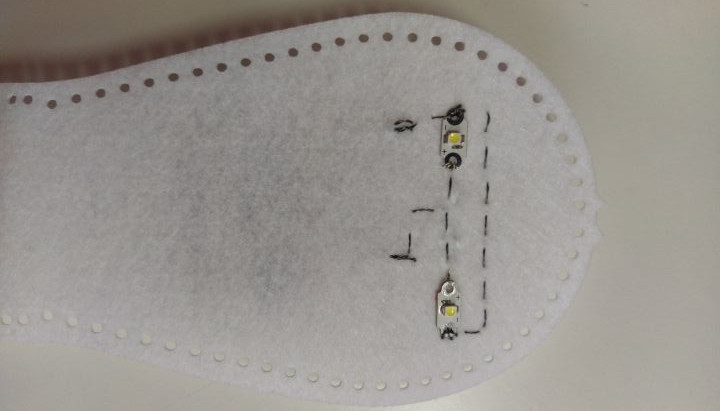
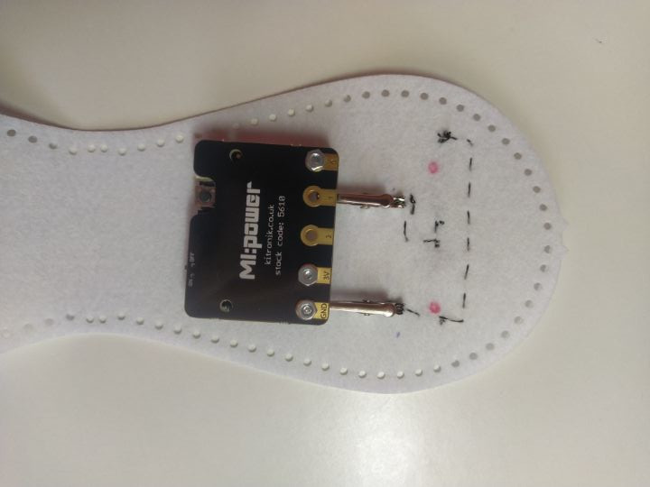
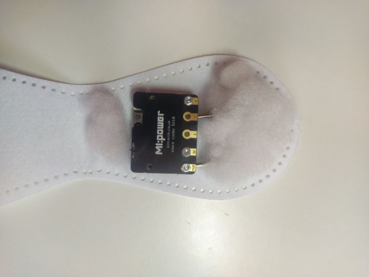
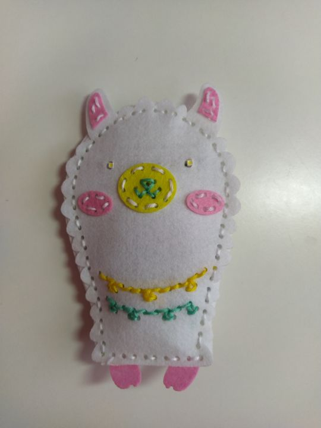

Title:   	Plyšová hračka
Teacher:	True

# Plyšová hračka
## 	Wearables (nositeľná elektronika)

// LEFT


// RIGHT

Dnes existuje veľké množstvo hračiek. Jedna kategória sa nazýva diy alebo do it yourself = urob si sám. Ide o hračky, ktoré si sami vyrobíme a to, čo kúpime v obchode, sú len nespojené látky, časti, súčiastky a iné. Poďme si vyrobiť vlastnú plyšovú hračku, napríklad lamu, ktorú upravíme tak, aby na nás žmurkala a dokázala zahrať rôzne melódie.

**Čo budeme potrebovať:**

*   diy plyšovú hračku alebo z plste vystrihnuté diely
*   obyčajné hrubšie nite
*   ihla
*   výplň (napr. vata)
*   BBC micro:bit
*   USB kábel
*   MI:power board (so zabudovaným reproduktorom)
*   krokosvorky
*   elektrovodivá niť

// END

// LEFT

Na ukážku máme diy plyšovú hračku - lamu. Najskôr sme vytvorili prednú časť hrubšími niťami, ktoré majú len dekoračný charakter. Niektoré takéto hračky majú už dopredu vydierkované línie, ktoré môžeme tupou ihlou šiť. Zároveň tupá ihla má výhodu - nemôžeme sa pichnúť, avšak musíme mať už dopredu vydierkované plochy.

V prípade, že nemáme takúto hračku, stačí, keď si vytvoríme prednú a zadnú časť, ktorá bude v jednom mieste spojená, napr. dole. Obe časti musia byť rovnaké, pretože sa pri šití bude vkladať výplň, čím nadobudne hračka 3D efekt.

#### Zapájanie LED diód

Na oči použijeme 2 nositeľné LED diódy s už zabudovanými rezistormi a pripojíme ho paralelným zapojením k micro:bitu. Krokosvorky pripojíme k micro:bitu a umiestnime ich tak, aby sa micro:bit zmestil do vnútra. Následne začíname od pinu 1 a našijeme 2 nositeľné LED diódy. Aj pri tomto projekte si treba uvedomiť, že šijeme dve vety - od pinu 1 k plusu a od GND k mínusu. Výsledok je taký, že micro:bit s krokosvorkami budú vo vnútri, zatiaľ čo LED diódy sú na vonkajšej strane.



// RIGHT


// END

// NEWPAGE

// LEFT



// RIGHT



// END

#### Výplň

// LEFT


Okolo micro:bitu pridáme výplň, ktorá nesmie obsahovať vodivé látky. Väčšinou však obsahuje len plast, ktorý nie je vodivý. Keď výplň máme, zošije všetky strany hračky tak, aby výplň nevypadla. Teraz však máme 2 problémy - micro:bit nevieme vybrať a nemáme v ňom nahratý žiadny program.

Keď hračku otočíme na zadnú časť, v mieste micro:bitu do nej nastrihneme ležaté H. To nám zabezpečí, že micro:bit z tade nevypadne, spredu nie je nič vidno, avšak micro:bit môžeme pomocou krokosvoriek kedykoľvek odpojiť bez toho, aby nám vypadla výplň.

// RIGHT



// END

// NEWPAGE

// LEFT

### Programujeme

Skúsme si určiť jasný cieľ programu: Keď hračkou potrasieme, vygeneruje nám náhodnú hudbu a zároveň bude imitovať žmurkanie cez blikanie LED diód.

Z kategórie _vstup_ vyberieme príkaz _keď potrasenie_. Potrebujeme nastaviť náhodné číslo napríklad od 1 do 5, takže si zadefinujeme _premennú_ s názvom _číslo_. Z kategórie _matematika_ vyberieme _vybrať náhodne 1 do 5_. Z _logiky_ vyberieme podmienku a porovnávanie, pričom do hodnoty _pravda_ vložíme premennú _číslo_ a ak bude číslo = 1, potom vyberieme z _hudby_ príkaz _spustiť melódiu zabávač opakovanie raz_. Kliknutím na plus v podmienke zadávame ďalšie podmienky, a tak si zadefinujeme, čo treba vykonať, pokiaľ sa vygeneruje číslo 2, 3, 4 alebo 5. Melódie si môžeme zvoliť podľa vlastných preferencií.

#### Žmurkanie

Žmurkanie alebo blikanie LED diód budeme programovať hneď za podmienkou. Obe oči musia svietiť a žmurkať rovnako, ale vďaka paralelnému zapojeniu nám nevzniká so synchronizáciou žiadny problém. Z kategórie _Kolíky_ vyberieme _digitálne zapísať kolik P1 hodnota 1_, pozastavíme, skopírujeme digitálny zápis s hodnotou 0, čím zhasneme LED diódy. Žmurkanie sa nedeje presne po určitom časovom intervale, a to si môžeme korigovať nastavením pozastavenia na rôzny počet milisekúnd. 

Následne program stiahneme a vyskúšame potriasť plyšovou hračkou. 


// RIGHT

```makecode
_2kW8hxW480yV
```

// END