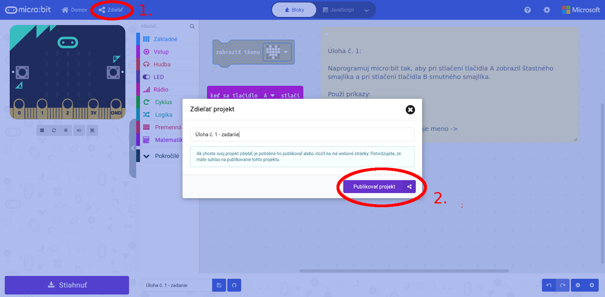

Title:   	MakeCode simulátor

# MakeCode simulátor
## Dištančne s micro:bitmi diel 1

Vzhľadom‌ ‌na‌ ‌pandemickú‌ ‌situáciu‌ ‌je‌ ‌ešte‌ ‌stále‌ ‌väčšina‌ ‌žiakov‌ ‌doma,‌ ‌čo‌ ‌sťažuje‌ ‌aj‌ ‌vyučovanie‌ ‌informatiky. Napriek‌ ‌tomu‌ ‌existuje ‌viacero‌ ‌možností,‌ ‌ako‌ takú hodinu informatiky kreatívne a zaujímavo odučiť aj na diaľku. Napríklad pomocou využitia micro:bitov.

Preto‌ ‌sme‌ ‌pre‌ ‌učiteľov‌ ‌pripravili‌ ‌viacdielny‌ ‌seriál článkov,‌ ‌kde‌ ‌im‌ postupne predstavíme‌ ‌rôzne‌ ‌prístupy‌ ‌a‌ ‌pomôcky využiteľné pri dištančnom vzdelávaní na hodinách informatiky.‌ ‌V‌ ‌prvom‌ ‌dieli‌ ‌sa‌ ‌pozrieme‌ ‌na‌ ‌online‌ ‌vyučovanie‌ ‌s‌ ‌pomocou‌ využitia ‌MakeCode‌ ‌simulátora.‌

// LEFT

Ak ste už pracovali s micro:bitmi, blokové programovacie prostredie [Microsoft MakeCode](http://makecode.microbit.org/) a simulátor, ktorý ponúka, pravdepodobne už poznáte. V tomto prostredí odporúčame začať pracovať najmä na základných školách, ale využiteľný je aj na stredných školách – najmä na zoznámenie sa s micro:bitmi či programovaním vo všeobecnosti. V micro:bit simulátore, ktorý sa nachádza v ľavej časti prostredia, je možné spustiť vytvorený program a simulovať stlačenie tlačidiel, pohyb či potrasenie micro:bitom alebo bezdrôtovú komunikáciu. Samozrejme, simulátor má svoje limity, najmä čo sa týka pripojenia externých senzorov a aktorov k micro:bitu, no aj tu sa dajú nájsť zaujímavé podporované zariadenia – napr. servo motorček či Neopixel LED pásik.

// RIGHT

// END

Pri dištančnom vyučovaní s MakeCode simulátorom viete zvoliť dva prístupy podľa toho, či vaši žiaci:

*   majú zaradenú informatiku do rozvrhu (záleží aj na počte hodín),
*   nemajú zaradenú v rozvrhu na dištančné vzdelávanie.

#### Priamo počas online hodín

Prvý prístup je pracovať so žiakmi priamo počas online hodín, ktoré majú v rozvrhu. Na začiatku hodiny sa žiaci pripoja napr. cez Zoom a postupne im zadávate menšie alebo väčšie úlohy. Vždy je vhodné im na začiatku pomocou zdieľanej obrazovky ukázať, ako sa v MakeCode orientovať, aké príkazy a kategórie na danej hodine budete používať a ako pracovať so simulátorom.

Žiaci pracujú buď v klasickom Microsoft MakeCode prostredí, alebo v špeciálnom [Microbit Classroom](http://classroom.microbit.org/) prostredí, ktoré “zaobalí” Microsoft MakeCode a ponúka tak učiteľovi niekoľko užitočných vecí:

*   Učiteľ vidí, ktorí žiaci sa mu prihlásili do Microbit Classroom.
*   Učiteľ si môže kedykoľvek na svojom počítači pozrieť program, ktorý žiak tvorí v MakeCode, a to bez komplikovaného zdieľania obrazovky.
*   Učiteľ môže všetkým (alebo len niekoľkým) žiakom zaslať program (či už aby videli správne riešenie, alebo aby v ňom našli a pomenovali chybu a opravili ju).
*   Učiteľ si na konci hodiny môže stiahnuť “report” vo formáte _docx_, v ktorom bude mať obrázky programov, ktoré žiaci počas hodiny vytvorili.
*   Učiteľ si môže Microbit Classroom aktivitu uložiť a na ďalšej vyučovacej hodine obnoviť – žiaci tak pokračujú v práci presne tam, kde na poslednej hodine skončili.

Microbit Classroom používame takmer každodenne, či už so žiakmi, alebo na školeniach pre učiteľov v rámci projektu ENTER a veľmi nám uľahčuje prácu. Žiaľ, niekedy sa stáva, že “zblbne” a chvíľu sa nedá žiakom pripojiť, prípadne všetkých žiakov odpojí. Z našich skúseností je to ale skôr výnimočné a riešenie v štýle “vypnúť-zapnúť (teda odhlásiť sa a znovu sa prihlásiť) nám zatiaľ takmer vždy zabral.

Viac o fungovaní a práci s Microbit Classroom sa môžete dozvedieť na našich [školeniach](http://ucimeshardverom.sk/skolenia/), kde ho využívame takmer na každom jednom online stretnutí.

// NEWPAGE

#### Samostatná práca

Druhý prístup – samostatná práca – je využiteľný najmä vtedy, ak žiaci nemajú v rozvrhu zaradený dostatočný počet hodín informatiky. Aj tu ale odporúčame aspoň prvú “zoznamovaciu” hodinu urobiť spoločne so žiakmi (ako bolo popísané vyššie) a až potom im zadávať úlohy na samostatnú prácu. Pri samostatnej práci je možné používať iba Microsoft MakeCode prostredie, ale nie prostredie Microbit Classroom.

Zadávať úlohy na samostatnú prácu je možné aj priamo v MakeCode pomocou komentárov. Môžete pre svojich žiakov pripraviť rôzne typy úloh, napr. prázdny projekt s komentárom, čo majú žiaci naprogramovať, alebo už existujúci projekt s komentárom, čo majú žiaci opraviť, prípadne doplniť program, aby fungoval správne. Takéto komentáre je možné využívať aj v Microbit Classroom.

Akonáhle projekt s komentárom pripravíte, môžete ho žiakom zdieľať pomocou linku kliknutím na tlačidlo “Zdieľať” vľavo hore. Pri zdieľaní je možné nastaviť aj zdieľaný názov projektu. Následne sa zobrazí link, ktorý môžete poslať žiakom či už cez e-mail, EduPage, Teams... Žiaci úlohy vypracujú a buď vám riešenia pošlú rovnakým spôsobom späť, alebo si ich spoločne prejdete na online hodine.

// NEWPAGE

#### Konkrétne aktivity

Čo sa týka aktivít, ktoré je možné robiť so žiakmi, odporúčame začať týmito:

*   [Výpis textu na displeji.](https://enter.study/navod/programovanie-displeja-digitalna-menovka/)
*   [Animácie pri stlačení tlačidiel.](https://enter.study/navod/tlacidla-na-microbite/)
*   Programy, ktoré pracujú s [nakláňaním či potrasením micro:bitu.](https://enter.study/navod/senzor-pohybu-akcelerometer/)
*   Aktivity so zvukom –[ simulátor vie prehrávať aj hudbu.](https://enter.study/navod/programovanie-hudby-zahraj-kohutika-jarabeho/)

Následne môžete prejsť aj na náročnejšie aktivity:

*   Aktivity využívajúce zabudované senzory teploty, hluku, svetla, …
*   Ovládanie NeoPixel LED pásika.
*   Programy, ktoré využívajú bezdrôtovú komunikáciu. Na takéto aktivity môže byť vhodný aj špeciálny Multi mód v MakeCode, ktorý si predstavíme v ďalšom z dielov tejto série.

Inšpiráciu môžete čerpať zo stránok [enter.study](http://enter.study/databaza-vedomosti/), [Učíme s Hardvérom](https://www.ucimeshardverom.sk/materialy/microbit_makecode) či [Akadémia Programovania](https://akademiaprogramovania.sk/ako-kodit-doma/). Na všetky spomenuté aktivity v súčasnosti organizujeme [školenia pre učiteľov](http://ucimeshardverom.sk/skolenia/). Zároveň máte možnosť prihlásiť Vašu triedu na [online workshop](https://docs.google.com/forms/d/e/1FAIpQLSdt9VDNw6n-l-MgZcJtNETB4368aZ4GsXnJABW-pbO-iVLkTg/viewform).

V prostredí MakeCode je možné programovať aj v JavaScripte a Pythone a oba tieto kódy je možné taktiež simulovať. Kým JavaScript na slovenských školách nie je až taký rozšírený, Python áno. Tu by sme ale chceli veľmi dôrazne upozorniť, že Python v MakeCode je úplne iný ako Python pre micro:bity, ktorý sa využíva v [Mu](https://codewith.mu/) editore alebo v [Online Python editore](https://python.microbit.org/). Zároveň, Python v MakeCode bol rýchlo “spackaný” z JavaScriptu v MakeCode, a to znamená, že pri pohľade naň má človek pocit, že sa skôr pozerá na JavaScript ako na Python. Výsledok – **neodporúčame používať Python v MakeCode editore.** Hore spomenuté alternatívy ([Mu](https://codewith.mu/) a [Online Python Editor](https://python.microbit.org/)) sú oveľa vhodnejšie na vyučovanie Pythonu, aj keď, žiaľ, tie neposkytujú simulátor.

!!! info ""

	Ak vám po prečítaní tohto článku napadli nejaké otázky, prípadne ďalšie nápady k online vyučovaniu, neváhajte nám ich napísať na [microbit@python.sk](mailto:microbit@python.sk) – budeme vďační za každú jednu otázku či podnet. V ďalšom dieli sa pozrieme na to, ako učiť s micro:bitmi, keď ich učitelia rozdajú žiakom domov.

