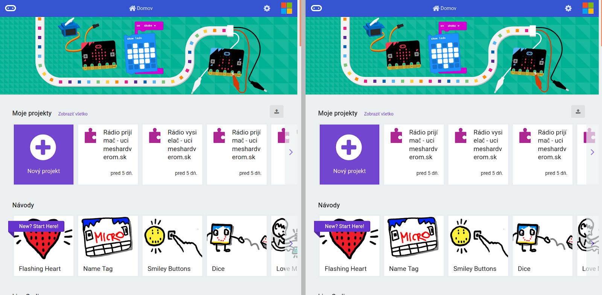
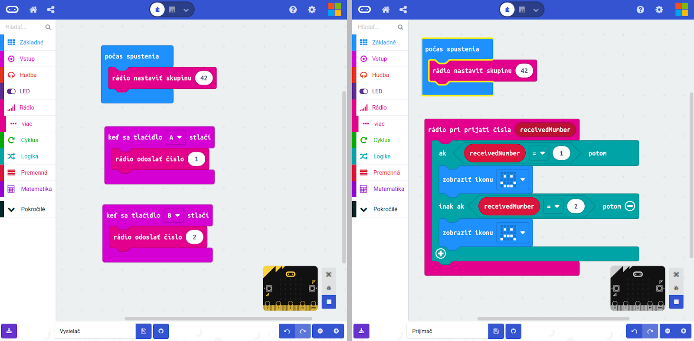
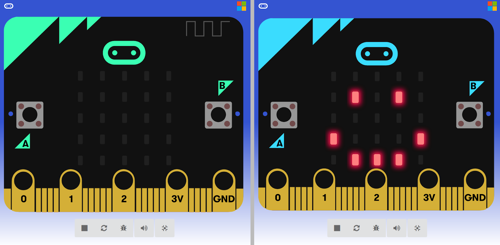

Title:   	Bezdrôtová komunikácia v MakeCode Multi Editore

# MakeCode Multi Editor

## Dištančne s micro:bitmi diel 3

V treťom dieli k dištančnej výučbe s micro:bitmi sa pozrieme na špeciálny mód v prostredí MakeCode na prácu s dvoma programami naraz, čo pomôže najmä pri tvorbe programov s bezdrôtovou komunikáciou.

Na vstup do MakeCode Multi Editora slúži odkaz: [makecode.microbit.org/\-\-\-multi#](https://makecode.microbit.org/---multi#)

Po otvorení MakeCode Multi Editora sa zobrazí klasická úvodná MakeCode stránka, ale hneď dvakrát. V oboch častiach je možné buď vytvoriť nové projekty, alebo otvoriť už existujúce projekty. Dôležité je neotvárať ten istý projekt v oboch častiach naraz, keďže vtedy editor nefunguje správne, pretože nevie, ktorý program má automaticky ukladať – najmä vtedy, ak sú zrazu oba odlišné, ale projekt je len jeden.

V nasledujúcom kroku si prejdeme, ako v Multi Editore vytvoriť dva jednoduché programy na vysielanie a prijímanie bezdrôtových správ. V každej polovici prostredia si vytvoríme jeden nový projekt – napr. vľavo "Vysielač" a vpravo "Prijímač".

Otvoria sa nám dve MakeCode prostredia, ktoré sú úplne samostatné – každá polovica má vlastnú knižnicu príkazov (vrátane rozšírení), micro:bit simulátor či tlačidlo na stiahnutie programu do micro:bita. Okrem toho sa stredová lišta dá posúvať v prípade, že potrebujete pre jeden projekt viac priestoru ako pre druhý.

Aby sme si prostredie vyskúšali, vytvoríme si dva programy, nech sa pri stlačení tlačidla A na vysielači na druhom micro:bite zobrazí šťastný smajlík. A pri stlačení tlačidla B na vysielači sa na druhom micro:bite zobrazí smutný smajlík. Detailný postup s vysvetlením jednotlivých príkazov nájdete na [enter.study](https://enter.study/wp-content/uploads/2021/06/enter.study-kto-soferuje-lepsie-gogo-vs-michaela-dorcikova-microbattle-7-mat7d.pdf), výsledné programy by mali vyzerať ako na obrázku nižšie.

### Simulátor

Vytvorené programy už stačí iba vyskúšať. Malé simulované micro:bity sa zobrazovali v pravej spodnej časti okien aj doteraz, ale aby sa simulované micro:bity zobrazovali na celé okno, je potrebné na ne kliknúť (prípadne na ikonku "Spustiť v režime na celú obrazovku", ktorá sa nachádza vedľa simulovaného micro:bitu).

Správnosť programov overíme stláčaním tlačidiel na prvom micro:bite (kliknutím ľavým tlačidlom na myši). Okrem rozsvietenia malej anténky na simulovanom micro:bite by sa na druhom micro:bite mal zobraziť šťastný alebo smutný smajlík.

MakeCode Multi Editor môže byť vhodné používať napríklad vtedy, ak chcete chcete so žiakmi preberať bezdrôtovú komunikáciu, ale nemajú k dispozícii dva fyzické micro:bity. Zároveň aj pri nahrávaní programov na fyzické micro:bity môže byť využitie Multi Editora praktické – žiak môže mať otvorený naraz program pre prijímač aj pre vysielač a tým sa mu budú ľahšie dohľadávať prípadné chyby či robiť úpravy v oboch programoch, pretože programy medzi sebou skutočne komunikujú.

---

Ak vám po prečítaní tohto článku napadli nejaké otázky, prípadne ďalšie nápady k online vyučovaniu, neváhajte nám ich napísať na microbit@python.sk – budeme vďační za každú jednu otázku či podnet.

