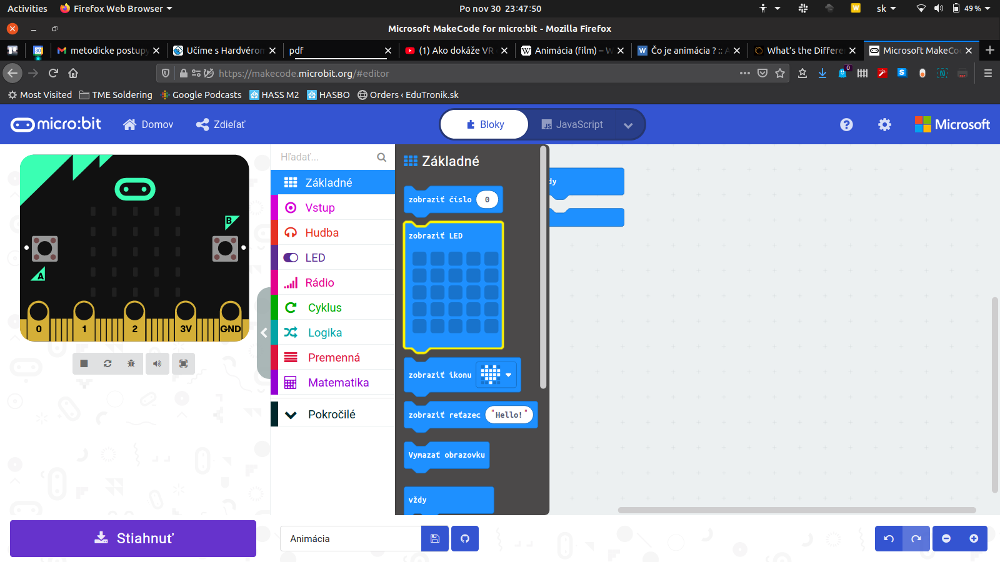
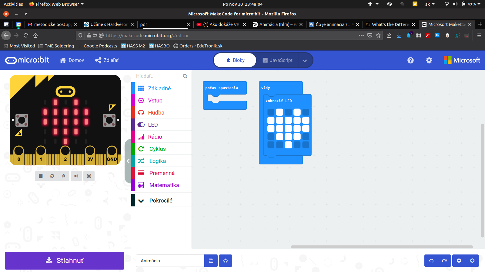

Title:   	Úvod

# Animácie
## micro:battle hodina #1

// LEFT

// RIGHT

Táto hodina je zameraná na animácie. Prejdeme si, čo to vlastne animacia je, ako animácie tvoriť na micro:bite a ako ich tvoria profesionáli.

**Potrebné pomôcky:** BBC micro:bit, USB kábel, počítač.  
Pracovať budeme v online prostredí [makecode.microbit.org](https://makecode.microbit.org/)

V predstihu zadajte žiakom (na domácu úlohu) pozrieť video youtubera Goga o [virtuálnej realite](https://www.youtube.com/watch?v=Eyr-geK-hPw).

// END

### 1. Otvorenie hodiny

Pred začatím aktivít s micro:bitmi sa žiakov spýtajte, čo nové sa dozvedeli vo videu o [virtuálnej realite](https://www.youtube.com/watch?v=Eyr-geK-hPw). Prejsť môžete témy:

* Čo je to animácia? (môžete si pomôcť rámčekom nižšie)
* Akú animáciu vo videu zobrazoval micro:bit? (animáciu srdiečka)
* Koľko pixelov má micro:bit? (5 krát 5 -- spolu 25 pixelov)
* Aký je rozdiel medzi virtuálnou a rozšírenou realitou? (môžete si pomôcť rámčekom v aktivite č. 4)

!!! info "Ako vzniká animácia?"
    Vytvoriť animáciu v zásade vôbec nie je náročné, stačí vytvoriť niekoľko obrázkov nejakej postavičky alebo objektu a každý z obrázkov iba mierne posunúť či poupraviť. Ak takýchto obrázkov spravíme dostatočne veľa a prehráme ich rýchlo za sebou ľudskému oku, splynú do spoločného obrazu -- animácie. Napríklad rýchlym prehrávaním šiestich obrázkov nižšie by sme získali animáciu skákajúcej loptičky.
    

### 2. Zobrazenie obrázku srdiečka na micro:bite

Žiakov naveďte na stránku [makecode.microbit.org](https://makecode.microbit.org/), kde je potrebné vytvoriť *Nový projekt* a ľubovoľne si ho menovať. V prípade, že sa prostredie otvorí v anglickom jazyku, je možné zmeniť jazyk kliknutím na ozubené koliesko hore vpravo a v sekcii *Language*.

// LEFT

// RIGHT

V prostredí MakeCode máme 3 časti:

* vpravo je miesto na tvorbu programu;
* v strede je knižnica príkazov, ktoré môžeme použiť;
* na ľavej strane je simulátor.

Keďže chceme zobraziť srdiečko, žiakom PREDSTAVTE príkaz z kategórie `Základné` s názvom `zobraziť LED`. Ten je potrebné vložiť do bloku `vždy` a vyklikať na ňom srdiečko.

// END

// NEWPAGE

// LEFT

// RIGHT

// END