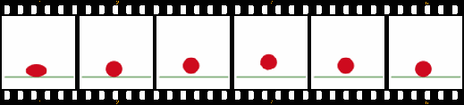
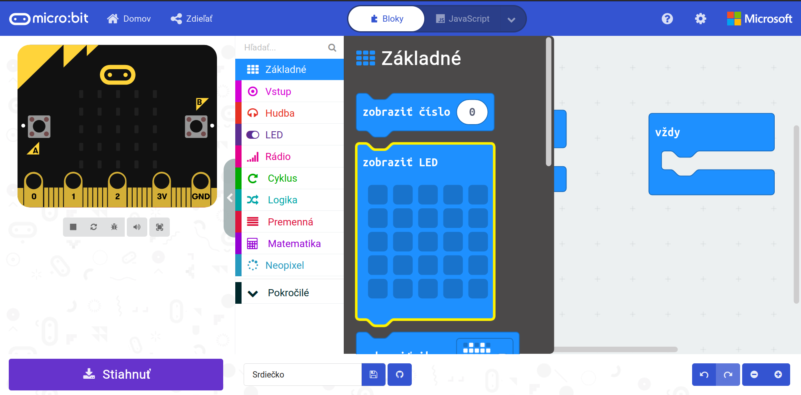
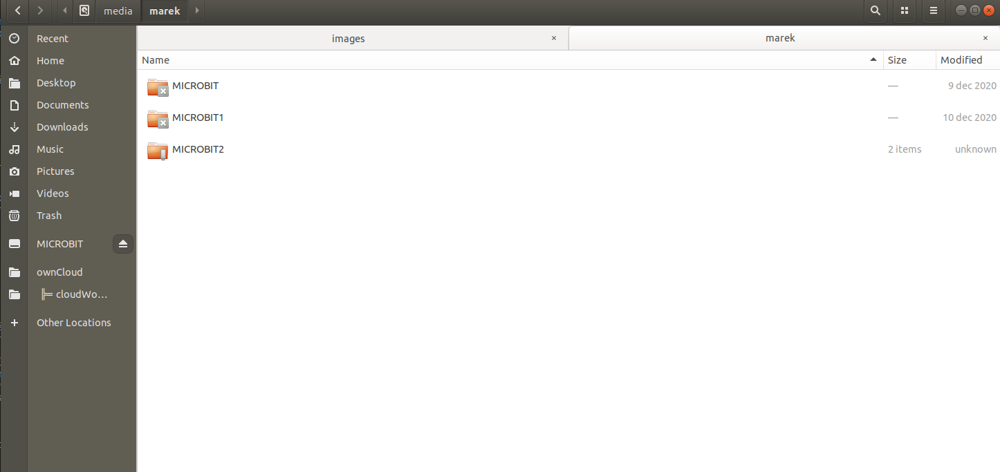
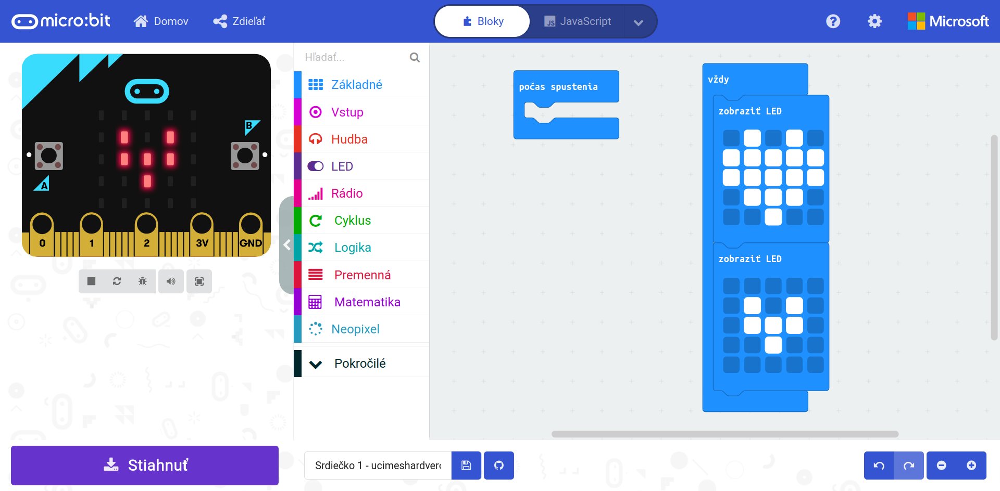

Title:   	Animácie

# Animácie
## micro:battle #1

// LEFT


// RIGHT

<div markdown="1" class="lection-desc">
Táto hodina je zameraná na animácie. Prejdeme si, z čoho sa skladá animácia a ako ich tvoriť na micro:bite.
</div>

**Potrebné pomôcky:** BBC micro:bit, USB kábel a počítač.  
Pracovať budeme v online prostredí [makecode.microbit.org](https://makecode.microbit.org/)


Pred aktivitami s micro:bitmi by si žiaci a žiačky mali pozrieť video youtubera GoGa o [virtuálnej realite](https://www.youtube.com/watch?v=Eyr-geK-hPw) (ako prípravu na hodinu).

// END

### 1. Otvorenie hodiny

Pred začatím aktivít s micro:bitmi sa žiakov a žiačok spýtajte, čo nové sa dozvedeli vo videu o [virtuálnej realite](https://www.youtube.com/watch?v=Eyr-geK-hPw). Prejsť môžete témy:

* Čo je to animácia? *(Môžete si pomôcť rámčekom nižšie.)*
* Akú animáciu vo videu zobrazoval micro:bit? *(Animáciu srdiečka.)*
* Koľko pixelov má displej na micro:bite? *(5 x 5 -- spolu 25 pixelov.)*
* Aký je rozdiel medzi virtuálnou a rozšírenou realitou? *(Môžete si pomôcť rámčekom na druhej strane tohto materiálu.)*


!!! info "Ako vzniká animácia?"
    Vytvoriť animáciu v zásade vôbec nie je náročné. Stačí vytvoriť niekoľko obrázkov nejakej postavičky alebo objektu a každý z obrázkov iba mierne posunúť či poupraviť. Ak takýchto obrázkov spravíme dostatočne veľa a prehráme ich rýchlo za sebou ľudskému oku, splynú do spoločného obrazu -- animácie. Napríklad rýchlym prehrávaním šiestich obrázkov nižšie by sme získali animáciu skákajúcej loptičky.
    

### 2. Zobrazenie obrázku srdiečka na micro:bite

Žiakov a žiačky naveďte na stránku [makecode.microbit.org](https://makecode.microbit.org/), kde je potrebné vytvoriť *Nový projekt* a ľubovoľne si ho pomenovať. V prípade, že sa prostredie otvorí v anglickom jazyku, je možné zmeniť jazyk kliknutím na ozubené koliesko vpravo hore a v sekcii *Language* zvoliť *Slovenčinu*. Odporúčame prvýkrát postup ukazovať žiakom a žiačkam na projektore.

// LEFT



// RIGHT

V prostredí MakeCode máme 3 hlavné časti:

* vpravo je miesto na tvorbu programu;
* v strede je knižnica príkazov, ktorú môžeme použiť;
* na ľavej strane je simulátor.

Keďže chceme zobraziť srdiečko, žiakom a žiačkam predstavte príkaz z kategórie `Základné` s názvom `zobraziť LED`. Ten je potrebné vložiť do bloku `vždy` a vyklikať na ňom srdiečko. Následne by sa automaticky malo srdiečko zobraziť v ľavej časti prostredia -- na micro:bit simulátore (niekedy je potrebné *reštartovať simulátor* pomocou tlačidiel pod simulátorom).


// END


// NEWPAGE

// LEFT

Aby sa srdiečko zobrazilo aj na micro:bitoch, ktoré držia žiaci a žiačky v rukách, je potrebné micro:bit pripojiť pomocou klasického micro USB kábla k počítaču (taký istý sa používa aj na nabíjanie väčšiny Android mobilov). V počítači sa po pripojení micro:bit zobrazí ako USB úložisko s názvom *MICROBIT* -- na toto úložisko budú žiaci a žiačky nahrávať svoj program.

Už máme všetko pripravené -- aj program v prostredí MakeCode, aj micro:bit pripojený pomocou USB kábla -- zostáva iba nahrať vytvorený program na micro:bit. Súbor s programom si žiaci a žiačky stiahnu do počítača pomocou tlačidla *Stiahnuť* dole vľavo. Do počítača sa im následne stiahne súbor so špeciálnou príponou *.hex* -- upozornite žiakov a žiačky, aby **tento súbor nijako neotvárali ani nespúšťali na počítači**. Jediné, čo stačí  spraviť, je skopírovať stiahnutý súbor s príponou *.hex* na úložisko *MICROBIT* -- ako keby sme kopírovali fotku z počítača na USBčko. Počas kopírovania sa rozbliká malá žltá indikačná LEDka na zadnej strane micro:bitu. Po jej doblikaní sa program automaticky spustí -- na displeji sa tým pádom rozsvieti srdiečko.

// RIGHT





// END


// LEFT

### 3. Animácia srdiečka

V tejto aktivite si žiaci a žiačky naprogramujú animáciu bijúceho srdiečka. Opäť na to využijú príkaz `zobraziť LED` z kategórie `Základné`, ktorý tiež vložia do bloku `vždy`. Na ňom je potrebné "vyklikať" zmenšené srdiečko (tak, ako je na ukážke kódu vedľa).

Ihneď po dokončení "vyklikávania" menšieho srdiečka by sa animácia mala zobraziť na simulátore v ľavej časti prostredia. Aby sa animácia zobrazovala aj na micro:bite, opäť je potrebné *Stiahnuť* nový súbor s príponou *.hex* a tento nový súbor nahrať na úložisko *MICROBIT*.

Pri opakovaných stiahnutiach nových programov z prostredia MakeCode sa môže stať, že niektorí žiaci a žiačky budú omylom nahrávať na micro:bit niektorý zo starších stiahnutých programov. **Žiakov a žiačky upozornite, aby si dávali pozor na to, či nahrávajú na micro:bit najnovší stiahnutý program.**


// RIGHT





// END

!!! info "Virtuálna realita vs. rozšírená realita"
    **Virtuálna realita** (skratka **_VR_**) využíva technológie na vytvorenie plne simulovaného sveta -- vo videu to bol simulátor *horskej dráhy* a *pádu z vysokej budovy*. Užívateľ sa väčšinou dokáže vo virtuálnom prostredí pohybovať. Vďaka tomu, že virtuálna realita je plne simulovaná, môže byť zasadená v akomkoľvek prostredí -- či už je to simulovanie horskej dráhy, vysokej budovy alebo úplne inej planéty. Na virtuálnu realitu sa väčšinou používajú špeciálne okuliare so slúchadlami (anglicky *VR headset*).

    **Rozšírená realita** (anglicky *Augmented reality*, skratka **_AR_**) je na rozdiel od virtuálnej reality zasadená v skutočnom svete, ktorý iba obohacuje. Na rozdiel od *VR* nie je na rozšírenú realitu potrebný špeciálny hardvér, *AR* aplikácie môžu byť spustené aj na bežných smarfónoch či tabletoch. Vo videu to bolo vidieť na aplikácii pre študentov medicíny, pomocou ktorej na reálnej stoličke "stálo" ľudské telo. Žiaci a žiačky tiež možno budú poznať populárnu *AR* videohru *Pokémon GO*, ktorá pomocou kamery telefónu a GPS súradníc prepájala herné prostredie s reálnym svetom. 

// NEWPAGE

// LEFT

### 4. Animácia snežného anjela

Pred tvorbou ďalšej animácie majú žiaci a žiačky dve možnosti -- buď vymazať program k predchádzajúcej aktivite (čo by bola samozrejme škoda) alebo vytvoriť si nový program kliknutím na tlačidlo *Domov* (hore vľavo). To žiakov a žiačky presmeruje na úvodnú stránku prostredia, kde je možné vytvoriť a pomenovať si nový projekt. Na tejto úvodnej stránke sa nachádzajú aj všetky uložené projekty, ktoré boli vytvorené v danom prehliadači.

Ďalšiu animáciu, ktorú si žiaci a žiačky vytvoria, je pohybujúca sa postavička, ktorá leží v snehu a kreslí doň "snežného anjela". To znamená, že postavička hýbe rukami aj nohami. Dopredu žiakom a žiačkam ukážte hotovú animáciu pomocou simulátora (neukazujte im zdrojový kód). Následne si animáciu so žiakmi a žiačkami rozdeľte na 4 časti:

**1. časť** -- panáčik má vystreté nohy a ruky vystreté vedľa seba  
**2. časť** -- panáčik urobí rukami oblúk hore  
**3. časť** -- panáčik posunie nohy smerom do strán  
**4. časť** -- panáčik posunie ruku naspäť k sebe  

Ak túto animáciu dáme do bloku `vždy`, animácia sa bude opakovať.

Pre zobrazenie ukážky animácie v simulátore si môžete kliknúť na odkaz dolu pod kódom vedľa a zvoliť možnosť *Simulátor*.

### 5. Záverečná diskusia

So žiakmi a žiačkami môžete diskutovať, v čom sa micro:bit displej odlišuje od displeja na mobile či v smart hodinkách:

- Micro:bit má iba 5 x 5 pixelov, obrazovky na počítačoch či mobiloch majú stovky až tisícky pixelov.
- Micro:bit má iba jednofarebné LEDky (pixely), bežné obrazovky vedia zobraziť akúkoľvek farbu.
- Pixely na micro:bite sú dosť "veľké" -- na približne 9 cm<sup>2</sup> sa zmestí iba 25 pixelov, bežné obrazovky na mobilných telefónoch pritom bežne na 1 cm<sup>2</sup> zmestia približne 160 pixelov, obrazovky s vysokým rozlíšením aj oveľa viac. 

Displej micro:bitu je síce veľmi jednoduchý, no aj takéto jednoduché displeje majú svoje využitie -- napríklad mnoho autobusov využíva jednofarebné LED displeje na zobrazovanie čísla autobusu. Zároveň môžu skúsenosti z programovania animácií na micro:bite niektorých žiakov a žiačky motivovať k tvorbe "náročnejších" animácií.


// RIGHT

```makecode
_3efL73cTo70T
```

// END

!!! info "Aktivity navyše"
    - Žiaci a žiačky majú pomocou internetu zistiť, aké rozlíšenie (koľko pixelov celkovo a koľko pixelov na cm<sup>2</sup>) má ich mobilný telefón.
    - Žiaci a žiačky môžu vytiahnuť svoje mobilné telefóny, tablety alebo inteligentné hodinky a skúsiť popísať, aké animácie na nich nájdu (napr. animácia zobrazenia notifikácie, otvorenie aplikácie atď.)
    - Žiaci a žiačky majú pomocou internetu nájsť čo najviac možných konkrétnych využití pre *VR* a *AR* -- napr. vo vzdelávaní, priemysle, zdravotníctve atď.
