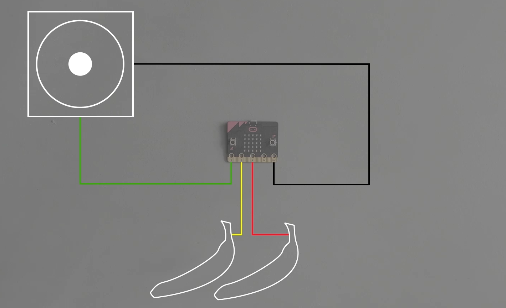

Title:   	Zvuk

# Zvuk
## micro:battle #2

// LEFT


// RIGHT

<div markdown="1" class="lection-desc">
Táto hodina je zameraná na tvorbu jednoduchého banánového klavíru pomocou micro:bitov. Pred hodinou je vhodné, aby žiaci už mali skúsenosti s prehrávaním hudby na micro:bite.
</div>

**Potrebné pomôcky:** BBC micro:bit, USB kábel, krokosvorkové káble, banány, počítač.  
Pracovať budeme v online prostredí [makecode.microbit.org](https://makecode.microbit.org/)

// END

*Táto hodina neobsahuje postup, ako pripojiť k micro:bitu reproduktor a ako prehrávať tóny. Ten nájdete v digitálnej databáze enter.study -- [lekcia "PROGRAMOVANIE HUDBY"](https://enter.study/navod/programovanie-hudby-zahraj-kohutika-jarabeho/) (odporúčame si ju prejsť so žiakmi pred tvorbou banánového klavíru). Pred nasledujúcimi aktivitami s micro:bitmi by si žiaci mali pozrieť video youtubera GoGa [s hudobným producentom Yakshom](https://www.youtube.com/watch?v=kq7v1HTrulw).*

### 1. Otvorenie hodiny

Pred začatím aktivít s micro:bitmi sa žiakov spýtajte, čo nové sa dozvedeli vo videu [s GoGom a Yakshom](https://www.youtube.com/watch?v=kq7v1HTrulw). Prejsť môžete témy:

* Na akom hudobno nástroji hrali GoGo a Yaksha vo videu? *(Banánový klavír.)*
* Hranie na banánovom klavíri vo videu veľmi nefungovalo. Vedeli by žiaci odhadnúť prečo? *(Banány sú vodivé a keďže boli naukladané husto vedľa seba, navajom sa dotýkali. Dotyk jedného banánu preto micro:bit mohol byhodnotiť ako dotyk viacerých banánov. Detailnejšie tomu bude možné pochopiť po prejdení si nasledujúcich aktivít.)*
* Ako technológie ovplyvňujú hudobné producenstvo? *(Vo videu bola spomenutá napr. hudba vytvorená čisto umelou inteligenciou.)*

### 2. Zapojenie banánového klavíru

// LEFT

// RIGHT



// END


// NEWPAGE

### 3. Program pre banánový klavír

// LEFT

// RIGHT


```makecode-no-link
_4a3Cko7HY8i2
```

```makecode-no-link
_3RDCELHe0L1Y
```

```makecode-link-only
_HHh4m1gqFcJu
```
// END

### 4. Záverečná diskusia

link na video s celým banánovým klavírom (s bezdrôtovou komunikáciou)
