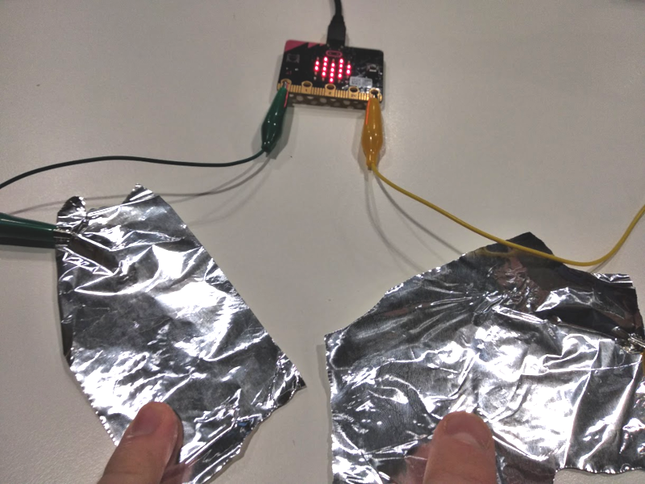
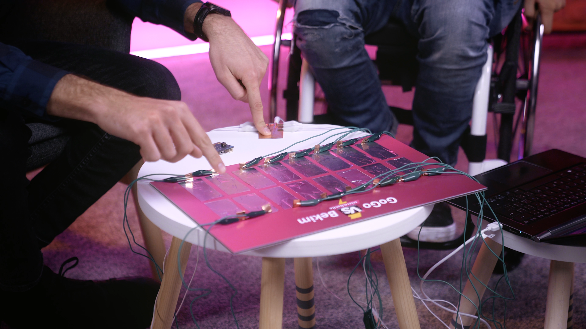

Title:   	Vstupné Piny (kolíky)

# Vstupné Piny (kolíky)
## micro:battle #5

// LEFT



// RIGHT

<div markdown="1" class="lection-desc">
Táto hodina je zameraná na uzatváranie obvodov pomocou "Pinov" -- malých vodivých plôšok na spodnej strane micro:bitu.
</div>

**Potrebné pomôcky:** BBC micro:bit, krokosvorkové kábliky, alobalová fólia, USB kábel a počítač.  
Pracovať budeme v online prostredí [makecode.microbit.org](https://makecode.microbit.org/)


Pred aktivitami s micro:bitmi by si žiaci a žiačky mali pozrieť video youtubera GoGa s [Bekimom](https://youtu.be/_1TZNzf1fHw) (ako prípravu na vyučovanie).

// END

### 1. Otvorenie hodiny

Pred začatím aktivít s micro:bitmi sa žiakov a žiačok spýtajte, čo nové sa dozvedeli vo videu s [Bekimom](https://youtu.be/_1TZNzf1fHw). Prejsť môžete témy:

* Ako GoGo a Bekim "otáčali" pexeso kartičky? *(Pomocou snímania uzatvorenia elektrického obvodu medzi dvoma kúskami alobalu -- GoGo to v rýchlosti vysvetľuje v čase 7:25.)*
* Ako sa prenášala informácia o *stlačení* alobalovej kartičky? *(Sériovou komunikáciou cez USB kábel medzi micro:bitom a počítačom.)*
* O akom pokroku v medicínskej technike sa GoGo a Bekim rozprávali? *(O navrátení aspoň čiastočnej kontroly pohybu do ochrnutých končatín -- v čase 12:00.)*


### 2. Kolíky = Piny

// LEFT

Predstavte žiakom a žiačkam kolíky. Kolíky sú malé kovové plôšky na spodnej strane micro:bitu
(anglický názov je "pin"). Na micro:bite sa nachádza 5 väčších kolíkov s označením *0*, *1*, *2*, *3V* a *GND*.

*   `GND` – zem alebo uzemnenie (z anglického "ground"), je možné predstaviť si ho ako "mínusovú/zápornú časť batérie". Na tomto pine je vždy zem (uzemnenie).
*   `3V` – napájanie na 3 volty, je možné predstaviť si ho ako "plusovú/kladnú časť batérie". Na tomto pine sú vždy 3 volty.
*   `0`, `1` a `2` – toto sú programovateľné vstupy/výstupy a vďaka nim vie micro:bit komunikovať s okolitým svetom,
    ovládať ho a snímať ho. Tieto kolíky sú pripojené priamo k mikroprocesoru.

Medzi týmito 5 veľkými kolíkmi sa nachádza množstvo malých. Každý z nich má svoj účel – niektoré slúžia ako napájanie
(`GND` / `3V`) a niektoré sú programovateľné vstupy/výstupy. Sú malé preto, aby sa zmestili na micro:bit. Ak by sme ich
chceli využiť, musíme použiť špeciálne zariadenia, do ktorých micro:bit zasunieme. To ale teraz nebudeme potrebovať.

// RIGHT

 ](images/microbit-pinout.png)


// END

// NEWPAGE


### 3. Snímanie zatvoreného obvodu na micro:bite

// LEFT

Obvody sa na micro:bite dajú zapájať rôznymi spôsobmi, v tejto aktivite budeme púšťať elektrický prúd z kolíka `GND` a snímať ho kolíkom `0`.
Žiaci na snímanie použijú príkaz `keď sa kolík P0 stlačí` z kategórie *Vstup*. Vždy, keď sa privedie prúd ku kolíku `0`,
zobrazí sa na chvíľu na LED displeji srdiečko. Program sa nachádza vpravo.

// RIGHT

```makecode
_Pmi8TjDPPfPg
```

// END


// LEFT

Fyzické zapojenie so žiakmi realizujte krokosvorkovými káblikmi. To sú obyčajné elektrické kábliky, ktoré majú na konci "krokodílku" – kovový konektor. Síce majú
rôzne farby, ale tie slúžia iba na to, aby sa dalo ľahšie rozlíšiť, o ktorý káblik ide. Inak fungujú všetky rovnako.

Po naprogramovaní micro:bitu naveďte žiakov, aby pripojili jeden koniec krokosvorkového kábla na kolík `GND` a druhý koniec držali v ruke a iba nakrátko sa ním
dotkli kolíka `0`. Vždy, keď sa obvod uzatvorí a otvorí, tak by sa na micro:bite malo zobraziť srdiečko (tak ako je
na obrázku vedľa.)

// RIGHT


// END

!!! danger "Snímanie vodivosti nefunguje správne"
    * Je možné, že snímanie nebude fungovať vždy správne a spoľahlivo v prípade, že je micro:bit pripojený k počítaču.
      Skúste v tom prípade radšej odpojiť micro:bit z USB kábla a napájať ho batériami.
    * Je dôležité, aby sa krokosvorka nedotýkala žiadneho iného kolíka okrem tých, ku ktorým má byť pripojená.
      Pre istotu skontrolujte, či majú žiaci všetko zapojené správne (niekedy pomôže aj trochu pohýbať krokosvorkami).


### 4. Alobalové elektródy a človek ako súčasť obvodu

// LEFT


V ďalšom kroku žiaci použijú na uzatvorenie obvodu dva káble. Jeden pripoja ku kolíku `0` a druhý ku kolíku `GND`.
Program z predchádzajúcej aktivity sa nemení.
Dotykom ich voľných koncov by sa malo na micro:bite zobrazovať srdiečko.

// RIGHT


Na voľné konce pripojených dvoch krokosvorkových káblov je možné pripojiť dva kúsky alobalu, ktoré slúžia ako "elektródy". Dôležité je, aby sa nedotýkali (tak ako na 
obrázku). Program nemeníme.

// END
 
// NEWPAGE

Nechajte žiakov vyskúšať:

* Priblížiť k sebe oba kúsky alobalu tak, aby sa dotkli. Potom ich znovu dať od seba.
* Zobrať tretí káblik a prepojiť ním dva kúsky alobalu. Potom ho dať preč.
* Jednou rukou držať prvý kúskok alobalu, pripojený ku kolíku `GND`, a druhou rukou sa iba krátko dotknúť druhého kúska alobalu (ktorý je pripojený ku kolíku `0`). 

Pri všetkých troch spôsoboch prepojenia obvodu by sa malo rozsvietiť na displeji srdiečko.

Prečo sa srdiečko zobrazilo, aj keď sa žiaci alobalov dotýkali prstami? Je to spôsobené tým, že ľudské telo je tiež vodivé, pretože obsahuje vodu. Práve kvôli vodivosti
ľudského tela je nebezpečné dotýkať sa elektrických káblov v zásuvke. Nie je potom ale nebezpečné dotýkať sa aj micro:bitu?
Odpoveď je nie, pretože napätie a najmä prúd prechádzajúci telom pri tejto aktivite je taký malý, že nehrozí žiadne
nebezpečenstvo. Ak by ale žiaci takto uzatvorili obvod v klasickej zásuvke, napätie aj prúd by boli väčšie a to by znamenalo
smrteľné nebezpečenstvo.

!!! primary "Živá reťaz"
	Keď sa dá uzatvoriť elektrický obvod jedným človekom, vieme obvod uzatvoriť aj cez viacerých ľudí? Nechajte si to žiakov a žiačky odskúšať -- navzájom sa môžu rukami pospájať do živej reťaze, prvý žiak sa dotkne prvého kúska alobalu a posledný žiak druhého kúska alobalu.

### 5. Záverečná diskusia

V rámci záverečnej diskusie môžete nechať žiakov a žiačky porozmýšľať (prípadne vyhľadať na internete informácie) o využitiach technológií v medicíne, špeciálne so zameraním na pomoc zdravotne znevýhodneným osobám.

---

### Aktivita navyše: Prepojenie micro:bitov s Pexeso programom na počítači
Táto aktivita je vhodná pre žiačky a žiakov stredných škôl, ktorí už vedia programovať v Pythone.

Vo videu bolo možné vidieť pexeso, ktoré sa zobrazovalo na počítači, avšak GoGo a Bekim stláčali alobalové kartičky na stolíku. Tento projekt tiež využíval príkazy `keď sa kolík P0 stlačí`, no namiesto zobrazovania obrázkov na displeji micro:bitu posielal informácie o stlačení jednotlivých kúskov alobalu počítaču cez USB sériovú komunikáciu. Na počítači bol zároveň spustený program naprogramovaný v jazyku Python, v ktorom sa zobrazovali kartičky. Tento program využíval okrem iného aj knižnicu *Tkinter*, populárnu na stredných školách.

Ak sú vaše žiačky a žiaci už pokročilí v programovaní v Pythone, môžete ich nechať spraviť podobný projekt. Zdrojový kód nájdete na týchto odkazoch:

// LEFT

* [Zdrojový kód pre Python aplikáciu využívajúcu Tkinter](https://github.com/marekmansell/pexeso)
* [Program v MakeCode pre prvý micro:bit](https://makecode.microbit.org/_UvF3jkYTUHjH)
* [Program v MakeCode pre druhý micro:bit](https://makecode.microbit.org/_1fAh5v4yUfDp)
* [Program v MakeCode pre tretí micro:bit](https://makecode.microbit.org/_DDx3i50h1HtM)
* [Program v MakeCode pre štvrtý micro:bit](https://makecode.microbit.org/_aRx6HbaWkRkM)
* [Program v MakeCode pre piaty micro:bit](https://makecode.microbit.org/_iVmHma920hk2)
* [Program v MakeCode pre šiesty micro:bit](https://makecode.microbit.org/_W9f2t4XUxWRz)

// RIGHT



// END