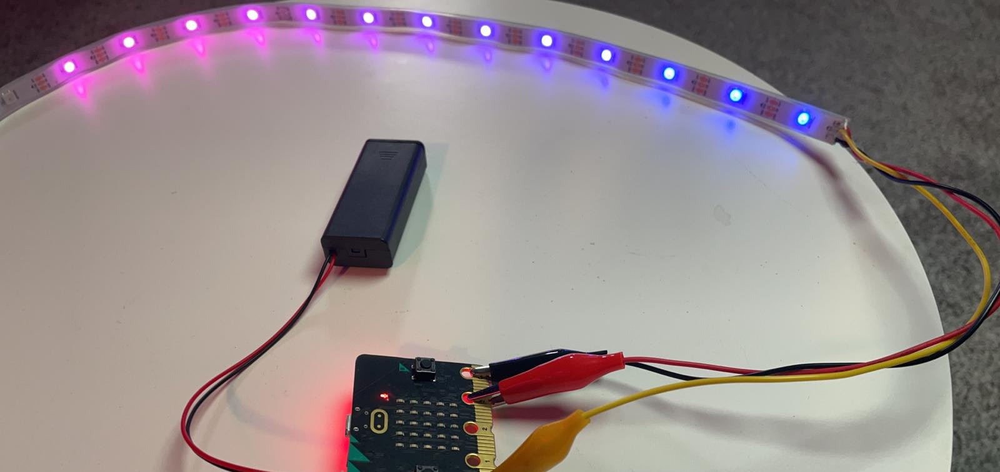
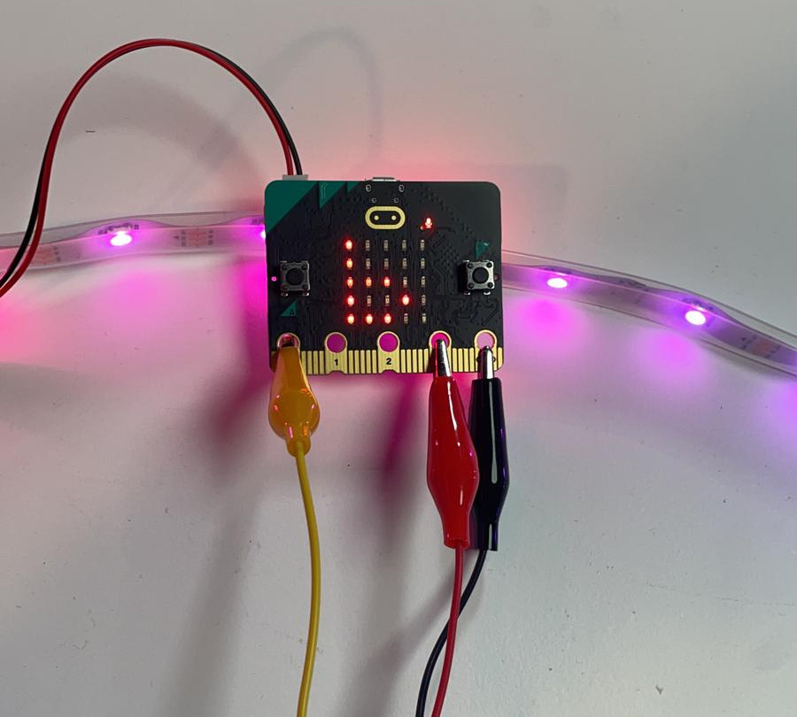

Title:   	LED pásik (Neopixel)

# LED pásik (Neopixel)
## micro:battle #6

// LEFT



// RIGHT

<div markdown="1" class="lection-desc">
Táto hodina je zameraná na programovanie individuálne adresovateľných LED pásikov, ktoré sú  nazývané aj Neopixel LED pásiky.
</div>

**Potrebné pomôcky:** BBC micro:bit, individuálne adresovateľný (Neopixel) LED pásik.  
Pracovať budeme v online prostredí [makecode.microbit.org](https://makecode.microbit.org/)


Pred aktivitami s micro:bitmi by si žiaci a žiačky mali pozrieť video youtubera GoGa s [Egom](https://youtu.be/3__VZ8dq7-s) (ako prípravu na vyučovanie).

// END

### 1. Otvorenie hodiny

Pred začatím aktivít s micro:bitmi sa žiakov a žiačok spýtajte, čo nové sa dozvedeli vo videu s [Egom](https://youtu.be/3__VZ8dq7-s). Prejsť môžete témy:

* Aké využitia LED osvetlenia ovládaného micro:bitom boli uvedené vo videu? *(napr. riadenie križovatiek, inteligentné semafory, farebné podsvietenie)*
* Ako sa využil micro:bit v micro:battle? *(zaznamenával intenzitu hluku -- pomocou zabudovaného senzora na micro:bit V2 -- a zobrazoval ju na LED pásiku)*


### 2. Rôzne druhy LED pásikov

Zjednodušene povedané, existujú tri základné druhy LED pásikov - jednofarebné, viacfarebné a individuálne adresovateľné.

!!! info ""

	* **Jednofarebné LED pásiky** sú asi najrozšírenejšie. Keď ich zapneme, všetky LEDky na LED pásiku svietia rovnakou farbou aj intenzitou. Často ich nájdete zabudované v kuchynských linkách, kde osvetľujú pracovnú plochu.
	* Na **viacfarebných LED pásikoch** je možné nastaviť rôzne farby, avšak celý LED pásik svieti vždy rovnakou farbou. Môže byť napríklad celý modrý, červený alebo biely, ale nikdy na ňom nebude naraz svietiť viac farieb.
	* Vizuálne najzaujímavejší je tretí druh - **individuálne adresovateľné LED pásiky**. Individuálne adresovateľné znamená, že pre každú jednu LEDku na LED pásiku viem nastaviť inú farbu a intenzitu svetla. Tým pádom na ňom viem zobraziť dúhu, alebo rovno aj animácie. Individuálne adresovateľné LED pásiky sa niekedy nazývajú aj NeoPixel LED pásiky.

Ako je možné, že individuálne adresovateľné LED pásiky vedia zobrazovať viacero farieb? Vďaka tomu, že každá jedna LEDka na LED pásiku je v skutočnosti oveľa zložitejšia, ako sa na prvý pohľad zdá -- obsahuje až tri miniatúrne LED diódy: červenú, zelenú a modrú. Ich "miešanie" funguje podobne ako miešanie temperových farieb. Ak zapneme iba zelenú a červenú farbu, no modrú necháme vypnutú, naše ľudské oko uvidí žltú farbu. Nastavovaním rôznej intenzity červenej a zelenej LEDky môžeme nastaviť, či má byť výsledná žltá farba tmavšia alebo bledšia.

// LEFT

](images/rgb_wiki.jpg)

// RIGHT

Princíp miešania farieb na LED pásiku si viete so žiakmi odskúšať aj formou experimentu -- použitím troch rôznych svetiel v tmavej miestnosti. Na obrázku si všimnite, ako miešaním zeleného, červeného a modrého svetla vznikajú na stene ďalšie farby -- žltá, tyrkysová a magentová na miestach, kde sa miešajú dve svetlá a samozrejme biela farba v strede.

Miešanie červeného, modrého a zeleného svetla je v informatike bežná vec -- presne na takomto princípe fungujú klasické LCD obrazovky. Žiaci si miešanie týchto troch farieb môžu vyskúšať aj pomocou [interaktívnej aplikácie](https://www.w3schools.com/colors/colors_rgb.asp).

Keďže vypisovať neustále farby "červená", "zelená" a "modrá" môže byť zdĺhavé, existuje pre ne skratka **RGB** (z anglického "Red, Green and Blue").

// END

### 3. Pripojenie Neopixel LED pásika k micro:bitu

Pripojenie NeoPixel LED pásika k micro:bitu je relatívne jednoduché, záleží to však od dvoch vlastností pripájaného LED pásika:

* *Dĺžka LED pásika* -- micro:bit dokáže spoľahlivo napájať iba Neopixel do dĺžky 8 až 10 LEDiek. Ak je už dlhší, je potrebné zapojenie pomocou externého zdroja (napr. 3ks AAA batérie).
* *Konektor LED pásika* -- najjednoduchšie sa pripájajú k micro:bitu LED pásiky s krokosvorkovými konektormi.


// LEFT

Neopixel LED pásik má zvyčajne tri farebne rozlíšené kábliky:

* **Červený** slúži na napájanie a pripájame ho ku kolíku 3V, čiže k trom voltom.
* **Čierny** slúži na uzemnenie a pripájame ho ku kolíku GND, čo je skratka anglického ground, v preklade zem.
* Tretí káblik má zvyčajne **žltú alebo zelenú farbu**. Pomocou neho micro:bit vysiela signály LED pásiku, akú farbu má nastaviť na ktorej LED dióde. Pripájame ho k vstupno výstupným kolíkom (napríklad P0).

!!! info "Upozornenie"

	**Pred pripájaním LED pásika k micro:bitu odporúčame odpojiť ho od USB kábla aj batérie. Pred opätovným zapojením micro:bitov k počítačom žiakom a žiačkam prekontrolujte zapojenia.**

// RIGHT



// END

### 4. Programovanie v prostredí MakeCode

Aby sme v prostredí MakeCode mohli programovať LED pásik, musíme kliknúť na kategóriu **Pokročilé** a následne na **Rozšírenia**. Otvorí sa nám stránka s rozšíreniami, na ktorej klikneme na **neopixel**.

// LEFT


// RIGHT


// END

Vľavo nám pribudla nová kategória - *Neopixel*. Z nej je potrebné vziať hneď prvý príkaz *Nastaviť strip na NeoPixel* - a vložiť ho do bloku *Počas spustenia*. Tento príkaz micro:bitu povie, ku ktorému kolíku je LED pásik pripojený a aký je dlhý. Keďže sme žltý káblik od LED pásiku pripojili ku kolíku 0, P0 necháme bez zmeny. Ešte je potrebné správne nastaviť dĺžku LED pásika.

// LEFT

Micro:bitu sme už povedali, kde má pripojený LED pásik, už ho stačí len rozsvietiť. Ak by sme chceli LED pásik rozsvietiť na červenú farbu, z kategórie Neopixel stačí vziať príkaz "strip show color red" a vložiť ho na koniec bloku "počas spustenia".

Po nahratí programu na micro:bit by sa žiakom a žiačkam mal LED pásik rozsvietiť na červeno. Ak tomu tak nie je, skontrolujte, či majú správne zapojenie a správne napísaný program.

// RIGHT

```makecode
_JkmgVEh6Aag9
```

// END

// NEWPAGE

### 5. Nastavovanie farieb pomocou RGB

// LEFT

V tejto aktivite sa vrátime naspäť k nastavovaniu farieb cez RGB, no namiesto [interaktívnej aplikácie](https://www.w3schools.com/colors/colors_rgb.asp) budeme hodnoty RGB nastavovať priamo na LED pásiku. Využijeme na to blok "red 255 green 255 blue 255". Ten nenájdeme v priamo v kategórií "Neopixel", ale v podkategórií "viac" (úplne dole). Nahradíme ním červenú farbu v príkaze "strip show color red".

// RIGHT

```makecode
_iDm8fpT0mYae
```

// END

Jednotlivé hodnoty červenej, modrej a zelenej farby sa nastavujú troma číslami. Ak napríklad červenú nastavíme na hodnotu *0*, nebude svietiť vôbec. Ak ju nastavíme na hodnotu *255*, bude svietiť najjasnejšie, ako vie. No a ak ju nastavíme na napríklad na hodnotu *128*, bude svietiť polovičnou intenzitou. Pre každú z RGB farieb je možné nastaviť ľubovoľnú hodnotu od *0* po *255* (vrátane).

### 6. Záverečná diskusia

So žiakmi a žiačkami môžete diskutovať, kde všade sa využíva LED osvetlenie ovládané mikroprocesorom. *(Napr. semafory, osvetlenie na diskotékach/koncertoch, LCD LED displeje...)*

!!! info "Aktivity navyše"
	- Pomocou internetu zistite ďalšie využitia inteligentných LED svetiel.
	- Pomocou internetu zistite, či existujú špeciálne LED pásiky na pestovanie rastlín a ak áno, v čom sa líšia od klasických RGB LED pásikov?
