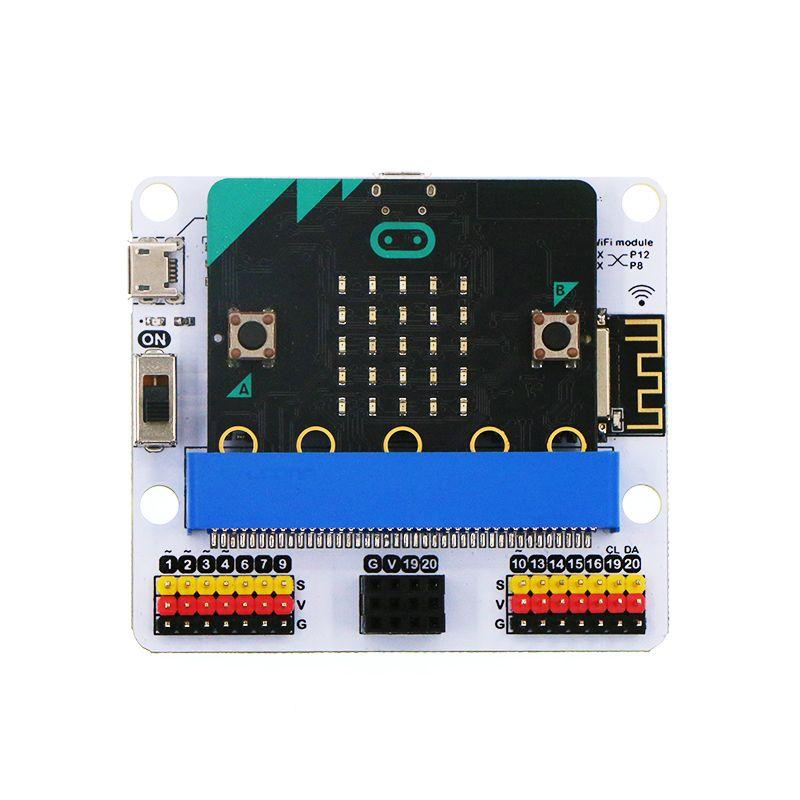

BBC micro:bit sám o sebe by nebol tak zaujímavý, a po pár hodinách by sme pravdepodobne vyčerpali jeho možnosti. Toho
sa ale nemusíme báť, pretože k micro:bitu môžeme vďaka vstupno/výstupným pinom na spodnej časti pripojiť takmer
čokoľvek. Od kúskov alobalu, cez LED diódy po senzory CO2.

Vypísaných je iba niekoľko ukážok toho, čo sa dá k micro:bitu pripojiť.

## Jednoduché obvody - krokosvorkové káble

Najjednoduchšie obvody sa dajú spraviť pomocou krokosvorkových káblov a alobalu. Krokosvorkový kábel je bežný vodivý
káblik so špeciálnymi koncovkami, ktoré sa podobajú krokodílím ústam.

 
 
 V obvode na obrázku sme prepojili pin `GND` s prvým kúskom alobalu a pin `0` s druhým kúskom alobalu. Micro:bit sme
 naprigramovali tak, aby snímal uzatvorenie obvodu medzi týmito dvoma pinmi. Ten uzatvoríme buť priamym dotykom alobalu
 o alobal, alebo dotykom našim rúk.
 
## LED pásik
 
 Pomocou krokosvoriek vieme ľahko pripojiť ak LED pásik. Tento konkrétny sa prezýva Neopixel a s micro:bitom naň
 vieme nastaviť rôzne farby pre každú jednu LEDku. Vďaka tomu sa dajú tvoriť svetelné animácie.  

## Reproduktor
K micro:bitu sa dá pripojiť takmer akýkoľvek reproduktor - či už sú to slúchadla, alebo veľké reproduktory so
zosilovačom. Stačí iba prepojiť konektor od reproduktorov s micro:bitom.

## Senzor vlhkosti a čerpadlo
V tomto prípade sme k micro:bitu pripojili jednoduché čerpadlo a senzor vhlkosti pôdy, aby sme si vytvorili
automatizovaný zavlažovací systém.  

## CO2 senzor
Vďaka CO2 senzorom je možné spraviŤ zariadenie, ktoré nás upozorní, kedy treba vyvetrať triedu :-)  

## WiFi modul
BBC micro:bit sa sám nevie pripojiť na internet (vie iba rádiovo komunikovať s ďalšími micro:bitmi, prípadne
pomocou Bluetooth s mobilmi). Stačí ale micro:bit zapojiť do rozširujúcej dosky, ktorá obsahuje WiFi modul a môžeme
veselo zapisovať údaje zo senzorov na internet.  

## Robot
Samozrejme čo by to bol za mikropočítač keby sme z neho nevedeli spraviť robota :-) Robotov pre micro:bit existuje
veľmi veľa, alebo si ho vieš aj sám zostrojiť!  

## a mnoho ďalších...
Tu vypísané príklady sú iba zlomkom možností, ktoré micro:bit ponúka. Stačí chvíľu poGoogliť a nájdeš plno ďalších
externých prídavkov k micro:bitu :-)