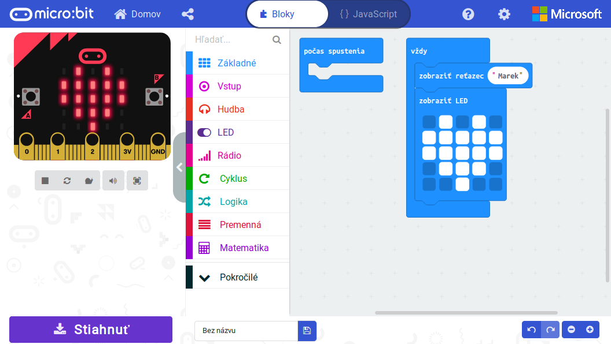

Prostredí pre micro:bit je mnoho, ale najpoužívanejšie sú online blokové prostredie MakeCode (ideálne pre žiakov
základných škôl) a MicroPython, ktorý je v online aj offline verzii (ideálny pre stredné školy).

## MakeCode
Prostredie [MakeCode](https://makecode.microbit.org/) od Microsoftu je ideálne pre začiatočníkov v programovaní.
Farebné blokové prostredie je veľmi intuitívne a podobné prostrediu Scratch, ktoré mnoho detí už pozná. Bloky kódu
je možné prepnúť a zobraziť kód v JavaScripte.

Stučný úvod do tohto prostredia nájdeš v predchádzajúcej kapitole [Prvý program](/zacni/prvy_program/).

Pre použitie na hodinách informatiky sme pripravili **súbor metodík** [BBC micro:bit & MakeCode](/materialy/microbit_makecode/)

*Ukážka MakeCode editoru*

## MicroPython
Pre stredoškolákov je väčšinou blokové programovacie prostredie už príliš jednoduché, a preto odporúčame jazyk 
MicroPython.

Klasický Python je veľmi populárny a všestranný programovací jazyk odporúčaný pre vyučovanie základov programovania.
Práve preto postupne nahrádza iné programovacie jazyky na hodinách informatiky. Vo veľkom Python využívajú aj v Google,
Dropbox, Európskej organizácii jadrového výskumu CERN, sociálnych sieťach Facebook, Pinterest a Instagram, či pri
vyučovaní na prestížnej vysokej škole MIT.

MicroPython je len trochu upravená verzia Pythonu, aby dokázala bežať aj na menej výkonných zariadeniach ako je
micro:bit.

Micro:bit v MicroPythone môžeme programovať v dvoch prostrediach - buď v [Mu editore](https://codewith.mu),
ktorý je viac plnohodnotným vývojovým prostredím, ale je potrebné ho inštalovať. Druhou možnosťou je 
[online Python editor](https://python.microbit.org), ktorý beží v prehliadači bez akejkoľvek inštalácie a je preto
vhodný pre prípady, kedy nie je možné nainštalovať Mu editor (napr. na krátkych workshopoch, kedy na to nie je dosť
času).

!!! success ""
     Ak máte možnosť používať Mu editor, tak zvoľte ten. Ponúka viac možností a lepšie sa v ňom hľdajú prípadné chyby.

Pre použitie na hodinách informatiky sme pripravili **súbor metodík** [BBC micro:bit & MicroPython](/materialy/microbit_micropython/)

*Ukážka Mu editoru*

*Ukážka Online MicroPython editoru*

## Classroom
V marci 2020 vyšla prvá verzia stránky [microbit.classroom.org](https://classroom.microbit.org/), ktorá umožňuje
učiteľom zvládať výučbu skupín žiakov. Classroom je strikne zameraný na používanie priamo počas hodiny - to znamená,
že učiteľ vie na začiatku hodiny vytvoriť svoj vlastný "classroom", na ktorý sa žiaci pripoja. K dispozícii je buď
prostredie MakeCode alebo onlien Python editor. Počas hodiny žiaci pracujú zo svojich počítačov a učiteľ
ich vie cez svoj počítač priebežne kontrolovať, prípadne s nimi zozdieľať nejaký program, ktorý majú dotvoriť.

Na konci hodiny vie učiteľ zozbierať programy žiakov jedným kliknutím zo svojho počítača a stiahnuť si ich na svoj
počítač. Tým sa práca v "classroom" končí a na ďalšiu hodinu si učiteľ musí vytvriť nový "classroom", alebo pokračovať
v tom istom.

Classroom vie byť veľmi užitočný pri učení na diaľku cez internet.
